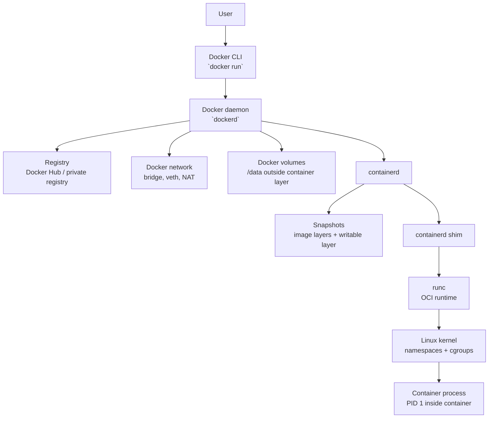

# Устройство Docker

Docker - это платформа для запуска приложений в контейнерах. Снаружи он выглядит как набор команд `docker run`, `docker pull`, `docker build`, но внутри работает несколько отдельных компонентов.

Главная идея: Docker не является одной большой программой, которая сама делает все. Он принимает команды, управляет образами и контейнерами, а низкоуровневое создание контейнера передает специализированным компонентам.

## Основные части Docker

В типичной установке Docker Engine есть такие части:

| Компонент | Что делает |
| --- | --- |
| Docker CLI | Команда `docker`, которую запускает пользователь |
| Docker daemon | Процесс `dockerd`, принимает API-запросы и управляет Docker-объектами |
| containerd | Container runtime daemon, отвечает за жизненный цикл контейнеров и images на более низком уровне |
| containerd shim | Маленький процесс-посредник между containerd и запущенным контейнером |
| runc | OCI runtime, который непосредственно создает контейнер через Linux namespaces и cgroups |
| storage driver | Управляет слоями образов и writable layer контейнера |
| network stack | Создает сети, bridge, veth-пары, правила NAT и изоляцию |
| volumes | Управляемое Docker хранилище данных вне writable layer контейнера |

## Docker CLI

Docker CLI - это клиентская команда `docker`.

Примеры:

```bash
docker run nginx
docker ps
docker inspect container_name
docker volume ls
```

CLI сам контейнеры не запускает. Он отправляет запрос в Docker daemon через Docker API.

На Linux Docker CLI обычно общается с daemon через Unix socket:

```text
/var/run/docker.sock
```

На Docker Desktop путь может быть другим, потому что Docker Engine работает внутри служебной Linux VM.

## Docker daemon

Docker daemon - это процесс `dockerd`.

Он отвечает за Docker-уровень:

- принимает команды от Docker CLI;
- проверяет параметры запуска контейнера;
- управляет контейнерами, образами, сетями и volumes;
- скачивает images из registry;
- создает Docker networks;
- готовит mounts;
- передает низкоуровневые операции в containerd.

Проверить информацию о daemon:

```bash
docker info
```

Посмотреть процесс:

```bash
ps aux | grep dockerd
```

Важно: `dockerd` управляет Docker-объектами, но сам не является низкоуровневым runtime, который вызывает Linux namespaces и cgroups для каждого контейнера.

## containerd

containerd - это отдельный daemon для управления контейнерами и images на более низком уровне.

Он умеет:

- скачивать и хранить images;
- управлять snapshots слоев файловой системы;
- создавать и запускать container tasks;
- следить за процессами контейнеров через shim;
- предоставлять API для Docker и других систем.

Docker использует containerd как runtime-слой. Kubernetes тоже может работать с containerd напрямую через CRI, без `dockerd`.

Посмотреть процесс:

```bash
ps aux | grep containerd
```

Посмотреть containers через низкоуровневую утилиту, если она установлена:

```bash
sudo ctr containers list
sudo ctr tasks list
```

Обычно для повседневной работы с Docker `ctr` не нужен. Это инструмент ниже уровнем, чем команда `docker`.

## runc

runc - это OCI runtime.

OCI означает Open Container Initiative. Это набор спецификаций, которые описывают, как должен выглядеть image и как runtime должен запускать container.

runc делает самую низкоуровневую часть работы:

- создает Linux namespaces;
- применяет cgroups;
- настраивает root filesystem контейнера;
- применяет capabilities, seccomp, apparmor или SELinux-профили, если они используются;
- запускает основной процесс контейнера.

Проверить версию:

```bash
runc --version
```

Если упростить, `runc` - это программа, которая превращает подготовленную OCI-spec конфигурацию в реально запущенный Linux-процесс с изоляцией.

## Что такое shim

containerd shim - это небольшой процесс, который остается между containerd и процессом контейнера.

Обычно он называется примерно так:

```text
containerd-shim-runc-v2
```

Зачем нужен shim:

- держит связь со stdio контейнера;
- собирает exit status контейнера;
- позволяет containerd не быть прямым родителем процесса контейнера;
- позволяет контейнеру продолжать работать, даже если `dockerd` перезапустился;
- уменьшает зависимость запущенного контейнера от управляющих daemon-процессов.

Упрощенно:

```text
containerd -> shim -> runc -> process inside container
```

runc запускает контейнер и обычно завершает свою работу. Shim остается жить рядом с контейнером и присматривает за его процессом.

Посмотреть shim-процессы:

```bash
ps aux | grep containerd-shim
```

Почему это важно: если перезапустить `dockerd`, уже запущенные контейнеры обычно не должны умереть. Они живут не потому, что `dockerd` держит их как дочерние процессы, а потому что фактический процесс контейнера отделен через containerd и shim.

## Что происходит при docker run

Команда:

```bash
docker run -d --name web -p 8080:80 nginx
```

проходит примерно такой путь:

1. Docker CLI отправляет запрос в `dockerd`.
2. `dockerd` проверяет параметры: имя контейнера, image, ports, volumes, network.
3. Если image `nginx` отсутствует локально, Docker скачивает его из registry.
4. containerd получает image и готовит snapshots файловой системы.
5. Docker создает writable layer для контейнера.
6. Docker готовит network namespace, bridge, veth-пару и правила портов.
7. Docker готовит mounts: rootfs, volumes, bind mounts.
8. containerd создает task для контейнера.
9. containerd запускает shim.
10. shim вызывает runc.
11. runc применяет namespaces, cgroups и запускает основной процесс контейнера.
12. runc завершается, shim остается следить за контейнером.
13. `dockerd` показывает контейнер в `docker ps`.

## Схема



## Images, layers и snapshots

Docker image состоит из слоев.

Например, в Dockerfile:

```dockerfile
FROM ubuntu:22.04
RUN apt-get update
COPY app /app
CMD ["./app"]
```

каждая значимая инструкция создает или использует слой.

Когда контейнер запускается:

- read-only layers образа используются как база;
- сверху добавляется writable layer контейнера;
- изменения внутри контейнера пишутся в writable layer;
- при удалении контейнера writable layer обычно удаляется;
- volumes живут отдельно и не удаляются вместе с writable layer.

Посмотреть слои образа:

```bash
docker history nginx
```

Посмотреть storage driver:

```bash
docker info | grep -i "Storage Driver"
```

На Linux часто используется `overlay2`. На Docker Desktop детали storage находятся внутри Linux VM.

## Storage driver

Storage driver отвечает за то, как Docker хранит и объединяет layers.

Для `overlay2` идея такая:

- нижние read-only layers берутся из image;
- верхний writable layer принадлежит конкретному контейнеру;
- контейнер видит объединенную файловую систему;
- Docker хранит эти данные в своей служебной директории.

На Linux Docker Engine служебная директория обычно:

```text
/var/lib/docker
```

На Docker Desktop этот путь находится внутри Linux VM Docker Desktop.

## Сети Docker

Контейнер получает собственный network namespace. Это значит, что внутри контейнера есть свой набор сетевых интерфейсов, маршрутов и портов.

Для стандартной сети `bridge` Docker обычно делает так:

- создает bridge-интерфейс на хосте, часто `docker0`;
- создает veth-пару;
- один конец veth остается на хосте;
- второй конец попадает внутрь network namespace контейнера;
- настраивает IP-адрес контейнера;
- добавляет NAT и port forwarding через iptables или nftables.

Посмотреть Docker networks:

```bash
docker network ls
```

Посмотреть сеть подробнее:

```bash
docker network inspect bridge
```

Запуск с пробросом порта:

```bash
docker run -d --name web -p 8080:80 nginx
```

В этом примере порт `80` внутри контейнера будет доступен на хосте через `8080`.

## Volumes в архитектуре Docker

Volume - это данные, которые Docker хранит отдельно от writable layer контейнера.

Если контейнер удалить, writable layer удалится, но именованный volume останется:

```bash
docker volume create pgdata
docker run -d --name postgres -v pgdata:/var/lib/postgresql/data postgres
docker rm -f postgres
docker volume ls
```

На Linux volume со стандартным драйвером `local` обычно физически лежит здесь:

```text
/var/lib/docker/volumes/<volume_name>/_data
```

На Docker Desktop это путь внутри Linux VM, а не обычная папка macOS или Windows.

Подробнее: [Docker/volumes.md](volumes.md)

## Docker Desktop и Linux Docker Engine

На Linux Docker Engine работает прямо на Linux-хосте:

```text
Docker CLI -> dockerd -> containerd -> shim -> runc -> Linux kernel
```

На macOS и Windows нет нативного Linux kernel для Linux containers. Поэтому Docker Desktop запускает служебную Linux VM.

Упрощенно:

```text
macOS/Windows
  Docker CLI
  Docker Desktop
    Linux VM
      dockerd
      containerd
      shim
      runc
      Linux containers
```

Практические следствия:

- `/var/lib/docker` находится внутри VM;
- volumes тоже находятся внутри VM;
- сетевые правила работают иначе, чем на чистом Linux-хосте;
- `docker info` показывает Docker Engine внутри VM;
- контейнеры Linux все равно используют Linux kernel, просто этот kernel живет в VM.

## Диагностические команды

Показать версии клиента и сервера:

```bash
docker version
```

Показать общую информацию:

```bash
docker info
```

Показать процессы Docker-компонентов:

```bash
ps aux | grep dockerd
ps aux | grep containerd
ps aux | grep containerd-shim
```

Показать контейнеры:

```bash
docker ps
docker ps -a
```

Посмотреть подробную информацию о контейнере:

```bash
docker inspect container_name
```

Посмотреть PID основного процесса контейнера на хосте:

```bash
docker inspect -f '{{.State.Pid}}' container_name
```

Посмотреть процессы внутри контейнера:

```bash
docker top container_name
```

Посмотреть слои image:

```bash
docker history image_name
```

Посмотреть networks:

```bash
docker network ls
docker network inspect bridge
```

Посмотреть volumes:

```bash
docker volume ls
docker volume inspect volume_name
```

Посмотреть containerd-объекты, если установлен `ctr`:

```bash
sudo ctr namespaces list
sudo ctr containers list
sudo ctr tasks list
```

Проверить runc:

```bash
runc --version
```

## Короткая памятка

```text
docker CLI
  -> dockerd
    -> containerd
      -> containerd-shim
        -> runc
          -> Linux namespaces + cgroups
            -> process inside container
```

Главное:

- Docker CLI только отправляет команды.
- `dockerd` управляет Docker-объектами.
- containerd управляет жизненным циклом контейнеров ниже уровнем.
- shim удерживает связь с контейнером и отделяет его от daemon-процессов.
- runc непосредственно создает контейнер через механизмы Linux kernel.
- Образ состоит из layers, контейнер получает writable layer.
- Volumes живут отдельно от writable layer.
- На Docker Desktop все Linux-компоненты находятся внутри служебной VM.
