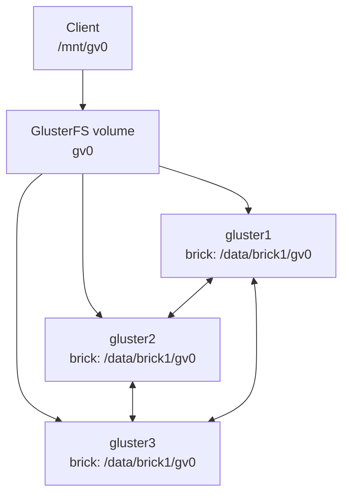

# Базовая настройка GlusterFS

GlusterFS - это распределенная файловая система, которая объединяет дисковое пространство нескольких Linux-серверов в один или несколько общих файловых томов.

Она полезна, когда нужно получить сетевое файловое хранилище без отдельного storage appliance: например, хранить общие файлы приложения, раздавать данные нескольким серверам или собрать отказоустойчивый файловый volume из локальных дисков.

Важно: GlusterFS не заменяет бэкапы. Репликация защищает от части отказов, но не спасает от удаления файлов, порчи данных, ошибок приложения и административных ошибок.

## Основные сущности

| Сущность | Что означает |
| --- | --- |
| Node / peer | Сервер GlusterFS, который входит в кластер |
| Trusted pool | Группа доверенных GlusterFS-серверов, объединенных через peer probe |
| Brick | Директория на сервере, которая отдается GlusterFS как часть volume |
| Volume | Логический файловый том, собранный из одного или нескольких bricks |
| Distributed volume | Volume, который распределяет файлы по bricks без репликации |
| Replicated volume | Volume, который хранит копии файлов на нескольких bricks |
| Arbiter | Специальный brick, который хранит метаданные и помогает избежать split-brain |
| Client | Сервер, который монтирует GlusterFS volume и работает с ним как с файловой системой |

Brick - это не просто случайная папка. Обычно под brick выделяют отдельный диск, раздел, LVM volume или отдельную файловую систему, смонтированную в стабильный путь.

## Базовая схема

Пример кластера из трех storage-нод и одного клиента:



Клиент монтирует не конкретную директорию с одного сервера, а GlusterFS volume. Дальше GlusterFS сам решает, где лежат файлы и с какими bricks нужно работать.

## Минимальные требования

Для учебного стенда достаточно:

- 2 или 3 Linux-сервера для GlusterFS;
- отдельный диск, раздел или LVM volume под brick на каждой ноде;
- стабильные hostname или DNS-записи для всех нод;
- одинаковое время на серверах через NTP/chrony;
- открытая сетевая связность между storage-нодами и клиентами;
- установленный `glusterfs-server` на storage-нодах;
- установленный `glusterfs-client` на клиентах.

Для отказоустойчивого replicated volume лучше использовать 3 ноды и `replica 3`. Реплика на двух нодах проще для тестов, но при сетевых проблемах чаще приводит к split-brain, если не продуманы quorum и процедуры восстановления.

## Пример стенда

Дальше используется такой пример:

| Роль | Hostname | IP |
| --- | --- | --- |
| Storage node 1 | `gluster1` | `10.0.10.11` |
| Storage node 2 | `gluster2` | `10.0.10.12` |
| Storage node 3 | `gluster3` | `10.0.10.13` |
| Client | `client1` | `10.0.10.21` |

Volume будет называться `gv0`, brick на каждой storage-ноде будет расположен в:

```text
/data/brick1/gv0
```

## Подготовка hostname

Если DNS нет, на всех storage-нодах и клиентах можно временно добавить записи в `/etc/hosts`:

```bash
sudo tee -a /etc/hosts >/dev/null <<'EOF'
10.0.10.11 gluster1
10.0.10.12 gluster2
10.0.10.13 gluster3
10.0.10.21 client1
EOF
```

Проверить:

```bash
getent hosts gluster1 gluster2 gluster3
ping -c 2 gluster2
```

## Установка пакетов

Команды отличаются между дистрибутивами. Ниже базовые варианты для Debian/Ubuntu и RHEL-подобных систем.

### Debian / Ubuntu

На storage-нодах:

```bash
sudo apt update
sudo apt install -y glusterfs-server
sudo systemctl enable --now glusterd
```

На клиентах:

```bash
sudo apt update
sudo apt install -y glusterfs-client
```

Если в стандартном репозитории дистрибутива слишком старая версия, используйте официальный репозиторий GlusterFS для своей версии ОС из документации проекта.

### RHEL / CentOS / Rocky / AlmaLinux

На storage-нодах:

```bash
sudo dnf install -y glusterfs-server
sudo systemctl enable --now glusterd
```

На клиентах:

```bash
sudo dnf install -y glusterfs glusterfs-fuse
```

Проверить службу:

```bash
sudo systemctl status glusterd
gluster --version
```

## Подготовка brick

Лучше размещать brick на отдельной файловой системе. Для примера допустим, что диск уже подготовлен и смонтирован в `/data/brick1`.

Проверить диск и mount point:

```bash
lsblk
df -h /data/brick1
```

Создать директорию под volume на каждой storage-ноде:

```bash
sudo mkdir -p /data/brick1/gv0
```

Проверить права:

```bash
ls -ld /data/brick1 /data/brick1/gv0
```

Не используйте корень системного раздела как постоянное место для production brick. Если системный диск заполнится из-за данных GlusterFS, сервер может стать нестабильным.

## Создание trusted pool

Команды peer probe достаточно выполнить с одной storage-ноды, например с `gluster1`.

На `gluster1`:

```bash
sudo gluster peer probe gluster2
sudo gluster peer probe gluster3
```

Проверить pool:

```bash
sudo gluster peer status
```

Ожидаемо, `gluster2` и `gluster3` должны быть в состоянии `Peer in Cluster (Connected)`.

## Создание replicated volume

Для трех нод создадим volume `gv0` с `replica 3`:

```bash
sudo gluster volume create gv0 replica 3 \
  gluster1:/data/brick1/gv0 \
  gluster2:/data/brick1/gv0 \
  gluster3:/data/brick1/gv0
```

Если GlusterFS предупреждает, что brick находится на root partition, для тестового стенда иногда добавляют `force`:

```bash
sudo gluster volume create gv0 replica 3 \
  gluster1:/data/brick1/gv0 \
  gluster2:/data/brick1/gv0 \
  gluster3:/data/brick1/gv0 \
  force
```

В production лучше исправить размещение brick, а не подавлять предупреждение через `force`.

Запустить volume:

```bash
sudo gluster volume start gv0
```

Проверить:

```bash
sudo gluster volume info gv0
sudo gluster volume status gv0
```

## Distributed volume

Distributed volume распределяет файлы по bricks, но не создает копии. Если один brick потерян, часть файлов становится недоступной.

Пример:

```bash
sudo gluster volume create gv_dist \
  gluster1:/data/brick1/gv_dist \
  gluster2:/data/brick1/gv_dist \
  gluster3:/data/brick1/gv_dist
```

Такой вариант подходит только там, где отказоустойчивость обеспечивается другим слоем или данные можно восстановить.

## Arbiter volume

Arbiter помогает снизить риск split-brain в конфигурации, где два data-brick и один arbiter-brick. Arbiter хранит служебную информацию, а не полную копию файловых данных.

Пример:

```bash
sudo gluster volume create gv_arb replica 3 arbiter 1 \
  gluster1:/data/brick1/gv_arb \
  gluster2:/data/brick1/gv_arb \
  gluster3:/data/brick1/gv_arb
```

Такую схему нужно проектировать осознанно: arbiter экономит место, но не заменяет полноценную третью копию данных.

## Подключение volume на клиенте

На `client1` создать mount point:

```bash
sudo mkdir -p /mnt/gv0
```

Смонтировать volume:

```bash
sudo mount -t glusterfs gluster1:/gv0 /mnt/gv0
```

Проверить:

```bash
df -h /mnt/gv0
mount | grep gv0
```

Можно указывать любую доступную storage-ноду из trusted pool:

```bash
sudo mount -t glusterfs gluster2:/gv0 /mnt/gv0
```

После монтирования клиент получает информацию о volume и дальше работает с нужными bricks через GlusterFS.

## Автомонтирование через fstab

Пример записи в `/etc/fstab`:

```fstab
gluster1:/gv0 /mnt/gv0 glusterfs defaults,_netdev 0 0
```

Проверить после редактирования:

```bash
sudo mount -a
df -h /mnt/gv0
```

Опция `_netdev` важна: она говорит системе, что файловая система зависит от сети.

## Проверка чтения и записи

На клиенте:

```bash
echo "hello from client1" | sudo tee /mnt/gv0/hello.txt
cat /mnt/gv0/hello.txt
sudo mkdir -p /mnt/gv0/test-dir
sudo touch /mnt/gv0/test-dir/file-{1..5}.txt
ls -la /mnt/gv0/test-dir
```

На storage-нодах можно посмотреть, где появились данные:

```bash
sudo find /data/brick1/gv0 -maxdepth 3 -type f -ls
```

Для replicated volume копии должны появиться на всех bricks реплика-сета.

## Диагностика

Проверить peers:

```bash
sudo gluster peer status
```

Показать volumes:

```bash
sudo gluster volume list
sudo gluster volume info
sudo gluster volume info gv0
```

Проверить bricks и порты:

```bash
sudo gluster volume status
sudo gluster volume status gv0
```

Проверить self-heal для replicated volume:

```bash
sudo gluster volume heal gv0 info
sudo gluster volume heal gv0 info summary
```

Посмотреть логи:

```bash
sudo journalctl -u glusterd
sudo ls -la /var/log/glusterfs
```

Проверить mount на клиенте:

```bash
df -h
findmnt /mnt/gv0
mount | grep gluster
```

## Базовое обслуживание

### Добавить новую ноду в pool

На одной из существующих storage-нод:

```bash
sudo gluster peer probe gluster4
sudo gluster peer status
```

Перед этим на `gluster4` должен быть установлен и запущен `glusterd`, а hostname должен резолвиться с остальных нод.

### Добавить brick в volume

Для distributed volume:

```bash
sudo gluster volume add-brick gv_dist gluster4:/data/brick1/gv_dist
```

Для replicated или distributed-replicated volume bricks добавляют группами, соответствующими replica count. Для `replica 3` нужно добавлять сразу три bricks:

```bash
sudo gluster volume add-brick gv0 replica 3 \
  gluster4:/data/brick1/gv0 \
  gluster5:/data/brick1/gv0 \
  gluster6:/data/brick1/gv0
```

После расширения distributed volume обычно нужен rebalance:

```bash
sudo gluster volume rebalance gv0 start
sudo gluster volume rebalance gv0 status
```

### Удалить brick

Для distributed volume удаление brick требует переноса данных:

```bash
sudo gluster volume remove-brick gv_dist gluster4:/data/brick1/gv_dist start
sudo gluster volume remove-brick gv_dist gluster4:/data/brick1/gv_dist status
sudo gluster volume remove-brick gv_dist gluster4:/data/brick1/gv_dist commit
```

Для replicated volume удаление bricks меняет отказоустойчивость. Перед такой операцией нужно проверить heal, бэкапы и план отката.

### Остановить volume

```bash
sudo gluster volume stop gv0
```

Если volume больше не нужен:

```bash
sudo gluster volume delete gv0
```

Удаление volume не равно аккуратному удалению данных с bricks. Перед удалением проверьте, что данные сохранены или больше не нужны.

### Удалить peer из pool

Сначала уберите bricks этой ноды из volumes, дождитесь завершения операций и проверьте статус.

Затем:

```bash
sudo gluster peer detach gluster4
```

## Важные замечания

### Split-brain

Split-brain возникает, когда разные bricks считают актуальными разные версии одних и тех же данных. Частая причина - сетевой раздел между нодами и одновременная запись.

Как снижать риск:

- использовать `replica 3` вместо `replica 2` для важных данных;
- включать и понимать quorum-настройки;
- следить за сетевой стабильностью между storage-нодами;
- регулярно проверять `gluster volume heal <volume> info`;
- не чинить split-brain вслепую без понимания, какая копия данных правильная.

### Quorum

Quorum помогает избежать ситуации, когда меньшая часть кластера продолжает принимать запись и создает конфликтующие версии файлов.

Проверить настройки volume:

```bash
sudo gluster volume get gv0 all | grep -i quorum
```

Перед изменением quorum-настроек нужно понимать поведение приложений при отказе нод: иногда корректнее временно отказать в записи, чем принять запись, которая потом приведет к конфликту.

### Сеть

GlusterFS чувствителен к задержкам, потерям пакетов и нестабильной связности. Для production лучше иметь отдельную storage-сеть или хотя бы контролируемый сетевой сегмент между storage-нодами.

Проверить базовую связность:

```bash
ping -c 3 gluster2
ss -tulpn | grep gluster
```

### Бэкапы

Репликация GlusterFS - это доступность, а не резервное копирование. Минимальный production-подход должен включать:

- регулярные бэкапы на независимое хранилище;
- проверку восстановления;
- защиту от случайного удаления;
- мониторинг свободного места;
- мониторинг heal backlog и состояния peers.

## Типовой порядок с нуля

Короткая последовательность для стенда из трех storage-нод:

```bash
# На всех storage-нодах
sudo apt update
sudo apt install -y glusterfs-server
sudo systemctl enable --now glusterd
sudo mkdir -p /data/brick1/gv0

# На gluster1
sudo gluster peer probe gluster2
sudo gluster peer probe gluster3
sudo gluster peer status
sudo gluster volume create gv0 replica 3 \
  gluster1:/data/brick1/gv0 \
  gluster2:/data/brick1/gv0 \
  gluster3:/data/brick1/gv0
sudo gluster volume start gv0
sudo gluster volume info gv0
sudo gluster volume status gv0

# На client1
sudo apt update
sudo apt install -y glusterfs-client
sudo mkdir -p /mnt/gv0
sudo mount -t glusterfs gluster1:/gv0 /mnt/gv0
echo test | sudo tee /mnt/gv0/test.txt
cat /mnt/gv0/test.txt
```

## Полезные ссылки

- Официальная установка: <https://docs.gluster.org/en/latest/Install-Guide/Install/>
- Настройка volumes: <https://docs.gluster.org/en/main/Administrator-Guide/Setting-Up-Volumes/>
- Подключение клиентов: <https://docs.gluster.org/en/latest/Administrator-Guide/Setting-Up-Clients/>
- Управление volumes: <https://docs.gluster.org/en/latest/Administrator-Guide/Managing-Volumes/>
