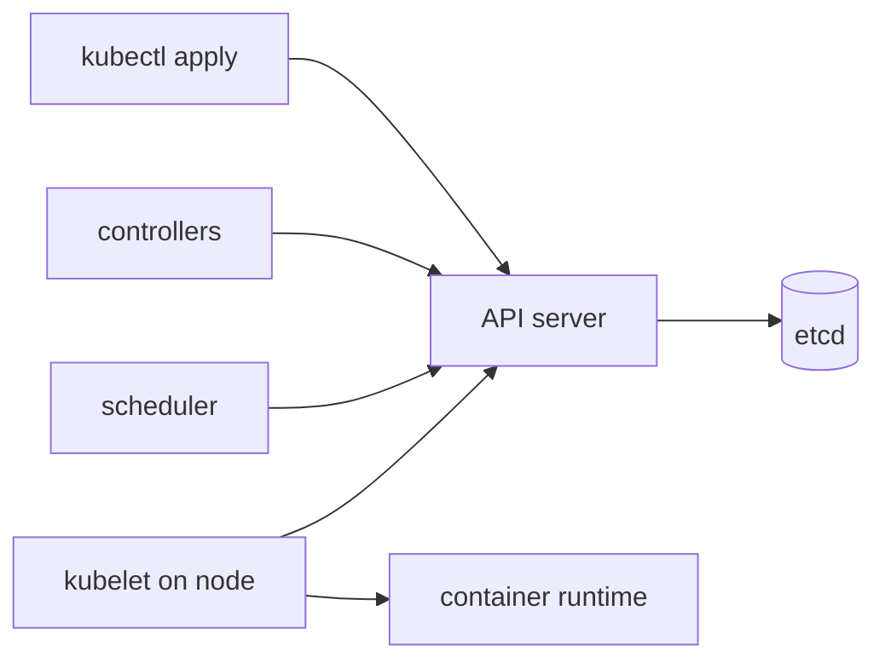

# Основные сущности Kubernetes

Эта инструкция объясняет базовые сущности Kubernetes простыми словами и дает примеры, которые можно повторить руками в тестовом кластере.

Цель не в том, чтобы сразу построить production-систему, а в том, чтобы увидеть механику Kubernetes: вы описываете желаемое состояние в YAML, отправляете его в API server, а контроллеры Kubernetes постепенно приводят кластер к этому состоянию.

## Что понадобится

Используйте только тестовый кластер: `kind`, `minikube`, `k3d` или отдельный sandbox. Не запускайте эти примеры в production namespace.

Проверьте текущий context:

```bash
kubectl config current-context
kubectl cluster-info
kubectl get nodes
```

Если context не тестовый, переключитесь до продолжения:

```bash
kubectl config get-contexts
kubectl config use-context kind-kind
```

Все примеры ниже работают в namespace `k8s-basics-demo`. Его можно удалить одной командой в конце, и Kubernetes удалит почти все созданные в нем объекты.

```bash
kubectl create namespace k8s-basics-demo
kubectl config set-context --current --namespace=k8s-basics-demo
kubectl get namespace k8s-basics-demo
```

## Kubernetes на пальцах

Kubernetes можно представить как систему управления заявками.

Вы говорите: "хочу, чтобы у меня всегда работали две копии nginx, доступные через стабильное имя". Это желаемое состояние. Kubernetes принимает эту заявку, записывает ее в свое хранилище и дальше постоянно сравнивает желаемое состояние с фактическим.

Если pod упал, Kubernetes создает новый. Если вы попросили три реплики вместо двух, Kubernetes добавляет еще одну. Если вы поменяли образ приложения, Kubernetes постепенно заменяет старые pod'ы новыми.

Упрощенная схема:



Главные роли:

- `API server` - входная дверь Kubernetes. `kubectl` общается именно с ним.
- `etcd` - хранилище состояния кластера.
- `scheduler` - выбирает node, на которой должен запуститься pod.
- `controller manager` - набор контроллеров, которые следят за объектами и создают недостающие ресурсы.
- `kubelet` - агент на каждой node, который запускает контейнеры и сообщает статус обратно.
- `container runtime` - containerd, CRI-O или другой runtime, который реально запускает контейнеры.

## Как читать Kubernetes YAML

Почти любой объект Kubernetes выглядит похоже:

```yaml
apiVersion: v1
kind: Pod
metadata:
  name: demo-pod
  namespace: k8s-basics-demo
  labels:
    app: demo
spec:
  containers:
    - name: nginx
      image: nginx:1.27
status:
  phase: Running
```

В manifest'ах, которые вы пишете сами, обычно есть четыре части:

- `apiVersion` - версия API для этого типа объекта.
- `kind` - тип объекта: `Pod`, `Deployment`, `Service`, `ConfigMap` и так далее.
- `metadata` - имя, namespace, labels, annotations.
- `spec` - желаемое состояние: что именно вы хотите получить.

Поле `status` обычно не пишут руками. Его заполняет Kubernetes. В нем отражается фактическое состояние: запущен ли pod, сколько реплик готово, какие ошибки возникли.

Посмотреть полный объект можно так:

```bash
kubectl get namespace k8s-basics-demo -o yaml
```

## Namespace

Namespace - это отдельная область имен внутри кластера. На пальцах: как папка для объектов. В разных namespace могут быть объекты с одинаковыми именами, и они не будут конфликтовать.

Namespace удобно использовать как песочницу:

```bash
kubectl get namespaces
kubectl get all -n k8s-basics-demo
```

Создадим namespace через YAML, чтобы увидеть декларативный подход. Если namespace уже создан, команда просто подтвердит, что он существует:

```bash
cat <<'EOF' | kubectl apply -f -
apiVersion: v1
kind: Namespace
metadata:
  name: k8s-basics-demo
EOF
```

Проверка:

```bash
kubectl get namespace k8s-basics-demo
kubectl describe namespace k8s-basics-demo
```

## Node

Node - это сервер, на котором Kubernetes запускает pod'ы. На пальцах: кластер - это ресторан, control plane принимает заказы и решает, что приготовить, а node - это кухня, где реально стоят плиты и работают контейнеры.

Node может быть физическим сервером, виртуальной машиной или локальной VM внутри `kind`/`minikube`. На каждой node обычно работают `kubelet`, container runtime и сетевые компоненты.

Посмотрите node'ы кластера:

```bash
kubectl get nodes -o wide
```

Подробности по конкретной node:

```bash
NODE_NAME=$(kubectl get nodes -o jsonpath='{.items[0].metadata.name}')
kubectl describe node "$NODE_NAME"
```

На что смотреть в выводе:

- `Conditions` показывает здоровье node: `Ready`, проблемы с memory, disk, network.
- `Addresses` показывает внутренние и внешние адреса.
- `Capacity` и `Allocatable` показывают общий и доступный для pod'ов CPU/memory.
- `Non-terminated Pods` показывает, какие pod'ы уже занимают ресурсы.
- `Events` помогает понять, были ли проблемы с node.

Обычно прикладные manifest'ы не привязывают pod к конкретной node. Scheduler сам выбирает подходящую node по ресурсам, ограничениям и правилам размещения. Для базового уровня важно помнить: pod всегда где-то запущен, и это "где-то" видно в колонке `NODE`.

## Pod

Pod - минимальная единица запуска в Kubernetes. На пальцах: это не "один контейнер", а маленькая общая квартира для одного или нескольких контейнеров. Контейнеры внутри одного pod'а живут на одной node, имеют общий network namespace и могут общаться через `localhost`.

В большинстве случаев pod'ы не создают вручную для production-приложений. Их создают через `Deployment`, `StatefulSet`, `DaemonSet` или `Job`. Но для обучения одиночный pod полезен.

Создадим pod с nginx:

```bash
cat <<'EOF' | kubectl apply -f -
apiVersion: v1
kind: Pod
metadata:
  name: demo-nginx-pod
  namespace: k8s-basics-demo
  labels:
    app: demo-nginx
    lesson: pod
spec:
  containers:
    - name: nginx
      image: nginx:1.27
      ports:
        - containerPort: 80
EOF
```

Проверка:

```bash
kubectl get pods
kubectl get pod demo-nginx-pod -o wide
kubectl describe pod demo-nginx-pod
kubectl logs demo-nginx-pod
```

Ожидаемый смысл результата:

- `STATUS` должен стать `Running`.
- В `READY` должно быть `1/1`.
- В `describe` видно, на какую node попал pod, какие events были при запуске, какой image скачан.
- `logs` у nginx сначала может быть пустым, потому что к нему еще не было HTTP-запросов.

Сделаем локальный доступ через port-forward:

```bash
kubectl port-forward pod/demo-nginx-pod 8080:80
```

В другом терминале:

```bash
curl http://127.0.0.1:8080/
```

После проверки остановите `port-forward` через `Ctrl+C`.

Удалим одиночный pod. Он не восстановится, потому что за ним не стоит контроллер:

```bash
kubectl delete pod demo-nginx-pod
kubectl get pods
```

## Labels, selectors и annotations

Labels - это короткие пары ключ-значение для группировки объектов. На пальцах: наклейки на коробках. По ним Kubernetes и человек понимают, какие объекты относятся к одному приложению, окружению или роли.

Selectors - это фильтры по labels. Service, Deployment и другие контроллеры часто находят свои pod'ы именно через selectors.

Annotations похожи на labels, но используются не для выбора объектов, а для дополнительной информации: заметок, настроек инструментов, служебных данных.

Создадим два pod'а с разными labels:

```bash
cat <<'EOF' | kubectl apply -f -
apiVersion: v1
kind: Pod
metadata:
  name: label-demo-web
  namespace: k8s-basics-demo
  labels:
    app: shop
    tier: web
  annotations:
    docs.example.com/comment: "frontend demo pod"
spec:
  containers:
    - name: nginx
      image: nginx:1.27
---
apiVersion: v1
kind: Pod
metadata:
  name: label-demo-worker
  namespace: k8s-basics-demo
  labels:
    app: shop
    tier: worker
spec:
  containers:
    - name: busybox
      image: busybox:1.36
      command: ["sh", "-c", "while true; do echo worker; sleep 30; done"]
EOF
```

Выборки:

```bash
kubectl get pods --show-labels
kubectl get pods -l app=shop
kubectl get pods -l tier=web
kubectl get pods -l 'tier in (web,worker)'
kubectl describe pod label-demo-web
```

Ожидаемый смысл результата: `app=shop` выберет оба pod'а, а `tier=web` только frontend pod.

Удалим эти pod'ы, чтобы дальше не мешали:

```bash
kubectl delete pod label-demo-web label-demo-worker
```

## ReplicaSet

ReplicaSet следит, чтобы всегда было запущено нужное количество одинаковых pod'ов. На пальцах: вы сказали "на столе всегда должно лежать три яблока"; если одно забрали, контроллер кладет новое.

На практике ReplicaSet почти никогда не пишут руками. Обычно его создает Deployment. Но полезно увидеть, как работает идея "держать N копий".

```bash
cat <<'EOF' | kubectl apply -f -
apiVersion: apps/v1
kind: ReplicaSet
metadata:
  name: demo-rs
  namespace: k8s-basics-demo
spec:
  replicas: 2
  selector:
    matchLabels:
      app: demo-rs
  template:
    metadata:
      labels:
        app: demo-rs
    spec:
      containers:
        - name: nginx
          image: nginx:1.27
EOF
```

Проверка:

```bash
kubectl get replicasets
kubectl get pods -l app=demo-rs
```

Удалите один pod и посмотрите, что ReplicaSet создаст замену:

```bash
POD_NAME=$(kubectl get pod -l app=demo-rs -o jsonpath='{.items[0].metadata.name}')
kubectl delete pod "$POD_NAME"
kubectl get pods -l app=demo-rs --watch
```

Когда увидите новый pod, остановите watch через `Ctrl+C`.

Удалим ReplicaSet. Его pod'ы удалятся вместе с ним:

```bash
kubectl delete replicaset demo-rs
```

## Deployment

Deployment - самый частый способ запускать stateless-приложение. На пальцах: это менеджер версии приложения. Вы говорите, сколько копий должно быть и какой image использовать, а Deployment создает ReplicaSet и управляет обновлениями.

Создадим Deployment на две реплики:

```bash
cat <<'EOF' | kubectl apply -f -
apiVersion: apps/v1
kind: Deployment
metadata:
  name: demo-web
  namespace: k8s-basics-demo
  labels:
    app: demo-web
spec:
  replicas: 2
  selector:
    matchLabels:
      app: demo-web
  template:
    metadata:
      labels:
        app: demo-web
    spec:
      containers:
        - name: nginx
          image: nginx:1.27
          ports:
            - containerPort: 80
EOF
```

Проверка:

```bash
kubectl get deployments
kubectl get replicasets
kubectl get pods -l app=demo-web -o wide
kubectl rollout status deployment/demo-web
```

Посмотрите связь через owner references:

```bash
kubectl get pods -l app=demo-web -o jsonpath='{range .items[*]}{.metadata.name}{" owner="}{.metadata.ownerReferences[0].kind}{"/"}{.metadata.ownerReferences[0].name}{"\n"}{end}'
```

Deployment владеет ReplicaSet, ReplicaSet владеет pod'ами. Если удалить pod, ReplicaSet создаст новый:

```bash
POD_NAME=$(kubectl get pod -l app=demo-web -o jsonpath='{.items[0].metadata.name}')
kubectl delete pod "$POD_NAME"
kubectl get pods -l app=demo-web
```

Изменим число реплик:

```bash
kubectl scale deployment demo-web --replicas=3
kubectl get pods -l app=demo-web
```

Сделаем rolling update:

```bash
kubectl set image deployment/demo-web nginx=nginx:1.28
kubectl rollout status deployment/demo-web
kubectl rollout history deployment/demo-web
kubectl get replicasets
```

Если новая версия плохая, можно откатиться:

```bash
kubectl rollout undo deployment/demo-web
kubectl rollout status deployment/demo-web
kubectl describe deployment demo-web
```

## Service

Pod'ы временные: их имена и IP могут меняться. Service дает стабильное имя и IP для набора pod'ов. На пальцах: pod'ы - это сотрудники, которые могут меняться, а Service - общий номер телефона отдела.

Создадим `ClusterIP` Service для pod'ов Deployment:

```bash
cat <<'EOF' | kubectl apply -f -
apiVersion: v1
kind: Service
metadata:
  name: demo-web
  namespace: k8s-basics-demo
spec:
  type: ClusterIP
  selector:
    app: demo-web
  ports:
    - name: http
      port: 80
      targetPort: 80
EOF
```

Проверка:

```bash
kubectl get service demo-web
kubectl get endpoints demo-web
kubectl get pods -l app=demo-web -o wide
```

Если endpoints пустые, почти всегда проблема в selector: Service не нашел pod'ы по labels.

Проверим доступ из временного pod'а:

```bash
kubectl run curl-test --rm -it --restart=Never --image=curlimages/curl:8.10.1 -- \
  curl -I http://demo-web
```

Можно проверить локально через Service:

```bash
kubectl port-forward service/demo-web 8080:80
```

В другом терминале:

```bash
curl -I http://127.0.0.1:8080/
```

После проверки остановите `port-forward` через `Ctrl+C`.

## ConfigMap

ConfigMap хранит некритичную конфигурацию отдельно от image. На пальцах: приложение остается тем же, а настройки лежат на отдельном листке бумаги.

Создадим ConfigMap:

```bash
cat <<'EOF' | kubectl apply -f -
apiVersion: v1
kind: ConfigMap
metadata:
  name: demo-config
  namespace: k8s-basics-demo
data:
  APP_MODE: "training"
  welcome.txt: |
    Hello from ConfigMap
    This file was mounted into the container.
EOF
```

Создадим pod, который получает одно значение как env, а файл как volume:

```bash
cat <<'EOF' | kubectl apply -f -
apiVersion: v1
kind: Pod
metadata:
  name: configmap-demo
  namespace: k8s-basics-demo
spec:
  containers:
    - name: busybox
      image: busybox:1.36
      command: ["sh", "-c", "echo APP_MODE=$APP_MODE; cat /config/welcome.txt; sleep 3600"]
      env:
        - name: APP_MODE
          valueFrom:
            configMapKeyRef:
              name: demo-config
              key: APP_MODE
      volumeMounts:
        - name: config-volume
          mountPath: /config
  volumes:
    - name: config-volume
      configMap:
        name: demo-config
EOF
```

Проверка:

```bash
kubectl logs configmap-demo
kubectl exec configmap-demo -- cat /config/welcome.txt
kubectl describe configmap demo-config
```

Важно: изменение ConfigMap не всегда мгновенно меняет поведение приложения. Env-переменные читаются при старте контейнера, поэтому для них нужен restart pod'а. Файлы из ConfigMap обновляются Kubernetes, но приложению все равно нужно уметь перечитывать файл.

## Secret

Secret похож на ConfigMap, но предназначен для чувствительных значений. На пальцах: это отдельный конверт с паролем, который можно подключить к pod'у.

Важно: обычный Kubernetes Secret не шифрует значение для человека сам по себе. В YAML часто видно base64, а base64 - это кодирование, не шифрование. В production нужно отдельно думать про RBAC, encryption at rest, External Secrets, Vault и ротацию.

Создадим учебный Secret:

```bash
kubectl create secret generic demo-secret \
  --from-literal=username=demo-user \
  --from-literal=password=demo-password
```

Посмотреть ключи без раскрытия значений:

```bash
kubectl describe secret demo-secret
```

Подключим Secret как env:

```bash
cat <<'EOF' | kubectl apply -f -
apiVersion: v1
kind: Pod
metadata:
  name: secret-demo
  namespace: k8s-basics-demo
spec:
  containers:
    - name: busybox
      image: busybox:1.36
      command: ["sh", "-c", "echo username=$USERNAME; test -n \"$PASSWORD\" && echo password_is_set; sleep 3600"]
      env:
        - name: USERNAME
          valueFrom:
            secretKeyRef:
              name: demo-secret
              key: username
        - name: PASSWORD
          valueFrom:
            secretKeyRef:
              name: demo-secret
              key: password
EOF
```

Проверка:

```bash
kubectl logs secret-demo
```

Для учебного просмотра можно декодировать значение:

```bash
kubectl get secret demo-secret -o jsonpath='{.data.username}' | base64 --decode
echo
```

Не делайте так с настоящими production-секретами в общих терминалах и логах.

## Volumes, PV и PVC

Контейнерная файловая система временная. Если pod удалить, файлы внутри контейнера пропадут. Volume подключает хранилище к pod'у.

На пальцах:

- `Volume` - "папка", примонтированная в pod.
- `PersistentVolume` или `PV` - реальный кусок хранилища в кластере.
- `PersistentVolumeClaim` или `PVC` - заявка приложения на хранилище.

Чаще всего вы создаете PVC, а кластер сам выдает PV через StorageClass.

Проверьте StorageClass:

```bash
kubectl get storageclass
```

Если в кластере нет default StorageClass, PVC ниже останется в `Pending`. Это нормально для обучения: вы увидите типовую проблему с хранилищем.

Создадим PVC:

```bash
cat <<'EOF' | kubectl apply -f -
apiVersion: v1
kind: PersistentVolumeClaim
metadata:
  name: demo-data
  namespace: k8s-basics-demo
spec:
  accessModes:
    - ReadWriteOnce
  resources:
    requests:
      storage: 1Gi
EOF
```

Проверка:

```bash
kubectl get pvc demo-data
kubectl describe pvc demo-data
```

Создадим pod, который пишет файл в PVC:

```bash
cat <<'EOF' | kubectl apply -f -
apiVersion: v1
kind: Pod
metadata:
  name: pvc-writer
  namespace: k8s-basics-demo
spec:
  containers:
    - name: busybox
      image: busybox:1.36
      command: ["sh", "-c", "date > /data/created-at.txt; cat /data/created-at.txt; sleep 3600"]
      volumeMounts:
        - name: data
          mountPath: /data
  volumes:
    - name: data
      persistentVolumeClaim:
        claimName: demo-data
EOF
```

Проверка:

```bash
kubectl get pod pvc-writer
kubectl logs pvc-writer
kubectl exec pvc-writer -- cat /data/created-at.txt
```

Если pod висит в `Pending`, смотрите причину:

```bash
kubectl describe pod pvc-writer
kubectl describe pvc demo-data
```

## StatefulSet

StatefulSet нужен для приложений, которым важны стабильные имена pod'ов, порядок запуска и отдельное хранилище на каждую реплику. На пальцах: Deployment запускает "любые две кассы", а StatefulSet запускает "касса-0", "касса-1", "касса-2", где у каждой своя тетрадь.

Примеры: Redis, PostgreSQL, Kafka, Elasticsearch. Для настоящих production-баз одного StatefulSet недостаточно, но для понимания сущности он полезен.

Создадим headless Service и StatefulSet:

```bash
cat <<'EOF' | kubectl apply -f -
apiVersion: v1
kind: Service
metadata:
  name: demo-stateful
  namespace: k8s-basics-demo
spec:
  clusterIP: None
  selector:
    app: demo-stateful
  ports:
    - name: http
      port: 80
---
apiVersion: apps/v1
kind: StatefulSet
metadata:
  name: demo-stateful
  namespace: k8s-basics-demo
spec:
  serviceName: demo-stateful
  replicas: 2
  selector:
    matchLabels:
      app: demo-stateful
  template:
    metadata:
      labels:
        app: demo-stateful
    spec:
      containers:
        - name: nginx
          image: nginx:1.27
          ports:
            - containerPort: 80
          volumeMounts:
            - name: html
              mountPath: /usr/share/nginx/html
  volumeClaimTemplates:
    - metadata:
        name: html
      spec:
        accessModes:
          - ReadWriteOnce
        resources:
          requests:
            storage: 1Gi
EOF
```

Проверка:

```bash
kubectl get statefulset demo-stateful
kubectl get pods -l app=demo-stateful
kubectl get pvc
```

Ожидаемый смысл результата:

- pod'ы называются `demo-stateful-0` и `demo-stateful-1`;
- PVC создаются отдельно для каждого pod'а;
- если удалить `demo-stateful-0`, новый pod получит то же имя и тот же PVC.

```bash
kubectl delete pod demo-stateful-0
kubectl get pods -l app=demo-stateful --watch
```

Остановите watch через `Ctrl+C`.

## DaemonSet

DaemonSet запускает по одному pod'у на каждой подходящей node. На пальцах: если Deployment - это "запусти три экземпляра где получится", то DaemonSet - "поставь по одному агенту на каждый сервер".

Примеры: node-exporter, log collector, CNI-agent.

Создадим простой DaemonSet:

```bash
cat <<'EOF' | kubectl apply -f -
apiVersion: apps/v1
kind: DaemonSet
metadata:
  name: demo-daemon
  namespace: k8s-basics-demo
spec:
  selector:
    matchLabels:
      app: demo-daemon
  template:
    metadata:
      labels:
        app: demo-daemon
    spec:
      containers:
        - name: busybox
          image: busybox:1.36
          command: ["sh", "-c", "while true; do echo node agent on $(hostname); sleep 60; done"]
EOF
```

Проверка:

```bash
kubectl get daemonset demo-daemon
kubectl get pods -l app=demo-daemon -o wide
kubectl logs -l app=demo-daemon --tail=5
```

Количество pod'ов обычно совпадает с количеством worker node, на которых DaemonSet может запускаться.

## Job

Job запускает задачу, которая должна выполниться и завершиться. На пальцах: не постоянный магазин, а курьерская доставка: сделал работу, получил `Completed`.

```bash
cat <<'EOF' | kubectl apply -f -
apiVersion: batch/v1
kind: Job
metadata:
  name: demo-job
  namespace: k8s-basics-demo
spec:
  template:
    spec:
      restartPolicy: Never
      containers:
        - name: worker
          image: busybox:1.36
          command: ["sh", "-c", "echo job started; date; echo job done"]
  backoffLimit: 2
EOF
```

Проверка:

```bash
kubectl get jobs
kubectl get pods -l job-name=demo-job
kubectl logs job/demo-job
kubectl describe job demo-job
```

## CronJob

CronJob создает Job по расписанию. На пальцах: будильник, который раз в заданное время запускает одноразовую работу.

Создадим CronJob, который должен запускаться каждую минуту:

```bash
cat <<'EOF' | kubectl apply -f -
apiVersion: batch/v1
kind: CronJob
metadata:
  name: demo-cronjob
  namespace: k8s-basics-demo
spec:
  schedule: "*/1 * * * *"
  successfulJobsHistoryLimit: 2
  failedJobsHistoryLimit: 2
  jobTemplate:
    spec:
      template:
        spec:
          restartPolicy: Never
          containers:
            - name: worker
              image: busybox:1.36
              command: ["sh", "-c", "echo cron run at $(date)"]
EOF
```

Проверка:

```bash
kubectl get cronjob demo-cronjob
kubectl get jobs
```

Чтобы не ждать расписание, можно создать Job вручную из CronJob:

```bash
kubectl create job demo-cronjob-manual --from=cronjob/demo-cronjob
kubectl logs job/demo-cronjob-manual
```

## Ingress

Ingress описывает HTTP/HTTPS-маршруты снаружи к Service внутри кластера. На пальцах: табличка на входе в здание: "если пришли на host `demo.local`, идите в Service `demo-web`".

Важно: сам Ingress - это только правило. Чтобы оно реально работало, в кластере должен быть Ingress Controller: nginx-ingress, Traefik, HAProxy, cloud load balancer controller или другой.

Проверьте, есть ли Ingress API:

```bash
kubectl api-resources | grep ingress
```

Создадим учебный Ingress. Даже если controller не установлен, объект может создаться, но внешний доступ работать не будет.

```bash
cat <<'EOF' | kubectl apply -f -
apiVersion: networking.k8s.io/v1
kind: Ingress
metadata:
  name: demo-web
  namespace: k8s-basics-demo
spec:
  rules:
    - host: demo.local
      http:
        paths:
          - path: /
            pathType: Prefix
            backend:
              service:
                name: demo-web
                port:
                  number: 80
EOF
```

Проверка:

```bash
kubectl get ingress demo-web
kubectl describe ingress demo-web
```

Если `ADDRESS` пустой, это обычно значит, что controller не выдал внешний адрес или его нет в кластере.

## Gateway API

Gateway API - более современный и расширяемый способ описывать входящий трафик. Он разделяет роли:

- `GatewayClass` - тип gateway, который умеет обслуживать конкретный controller.
- `Gateway` - точка входа: listener, port, protocol, hostnames.
- `HTTPRoute` - правила маршрутизации HTTP-запросов к Service.

На пальцах: `GatewayClass` - модель роутера, `Gateway` - конкретный роутер у входа, `HTTPRoute` - правила "какие запросы куда отправлять".

Gateway API может быть не установлен в тестовом кластере. Проверьте:

```bash
kubectl api-resources | grep gateway
kubectl api-resources | grep httproute
```

Если ресурсы есть и в кластере установлен controller, примерный `HTTPRoute` к нашему Service может выглядеть так:

```yaml
apiVersion: gateway.networking.k8s.io/v1
kind: HTTPRoute
metadata:
  name: demo-web
  namespace: k8s-basics-demo
spec:
  parentRefs:
    - name: demo-gateway
      namespace: k8s-basics-demo
  hostnames:
    - demo.local
  rules:
    - backendRefs:
        - name: demo-web
          port: 80
```

Этот блок намеренно не применяется автоматически: без установленного Gateway controller и подходящего `Gateway` он не заработает. Для базового понимания достаточно увидеть связь `HTTPRoute -> Service -> Pod`.

## Probes

Probes - проверки здоровья контейнера. На пальцах: Kubernetes не просто смотрит, запущен ли процесс, а может регулярно спрашивать приложение: "ты готов принимать трафик?" и "ты вообще жив?".

Основные виды:

- `readinessProbe` - готов ли pod получать трафик через Service.
- `livenessProbe` - живо ли приложение; при провале контейнер перезапускается.
- `startupProbe` - дает медленному приложению время стартовать до liveness-проверок.

Добавим readiness и liveness в Deployment:

```bash
cat <<'EOF' | kubectl apply -f -
apiVersion: apps/v1
kind: Deployment
metadata:
  name: demo-web
  namespace: k8s-basics-demo
spec:
  replicas: 2
  selector:
    matchLabels:
      app: demo-web
  template:
    metadata:
      labels:
        app: demo-web
    spec:
      containers:
        - name: nginx
          image: nginx:1.27
          ports:
            - containerPort: 80
          readinessProbe:
            httpGet:
              path: /
              port: 80
            initialDelaySeconds: 3
            periodSeconds: 5
          livenessProbe:
            httpGet:
              path: /
              port: 80
            initialDelaySeconds: 10
            periodSeconds: 10
EOF
```

Проверка:

```bash
kubectl rollout status deployment/demo-web
kubectl describe pod -l app=demo-web
kubectl get endpoints demo-web
```

Если readiness не проходит, pod может быть `Running`, но не попадать в endpoints Service.

## Requests и limits

Requests и limits описывают ресурсы контейнера.

На пальцах:

- `requests` - сколько ресурсов приложение просит зарезервировать при планировании;
- `limits` - выше какого потолка контейнеру нельзя подниматься.

Пример:

```bash
cat <<'EOF' | kubectl apply -f -
apiVersion: apps/v1
kind: Deployment
metadata:
  name: demo-web
  namespace: k8s-basics-demo
spec:
  replicas: 2
  selector:
    matchLabels:
      app: demo-web
  template:
    metadata:
      labels:
        app: demo-web
    spec:
      containers:
        - name: nginx
          image: nginx:1.27
          ports:
            - containerPort: 80
          resources:
            requests:
              cpu: 50m
              memory: 64Mi
            limits:
              cpu: 200m
              memory: 128Mi
EOF
```

Проверка:

```bash
kubectl describe pod -l app=demo-web
kubectl get deployment demo-web -o yaml
```

Если requests слишком большие для свободных ресурсов node, pod останется в `Pending`, а в events будет причина вроде `Insufficient cpu` или `Insufficient memory`.

## Типовая диагностика

Почти любую проблему начинайте с этих команд:

```bash
kubectl get all
kubectl get events --sort-by=.lastTimestamp
kubectl describe pod POD_NAME
kubectl logs POD_NAME
kubectl logs POD_NAME --previous
```

`describe` отвечает на вопрос "что Kubernetes пытался сделать и почему не получилось". `logs` отвечает на вопрос "что сказало само приложение".

### ImagePullBackOff

Создадим pod с несуществующим image:

```bash
cat <<'EOF' | kubectl apply -f -
apiVersion: v1
kind: Pod
metadata:
  name: broken-image
  namespace: k8s-basics-demo
spec:
  containers:
    - name: app
      image: nginx:tag-that-does-not-exist
EOF
```

Проверка:

```bash
kubectl get pod broken-image
kubectl describe pod broken-image
```

В events будет ошибка скачивания image. Исправление: указать существующий image tag или настроить доступ к registry.

Удалим сломанный pod:

```bash
kubectl delete pod broken-image
```

### CrashLoopBackOff

Создадим pod, который сразу завершается с ошибкой:

```bash
cat <<'EOF' | kubectl apply -f -
apiVersion: v1
kind: Pod
metadata:
  name: crash-demo
  namespace: k8s-basics-demo
spec:
  containers:
    - name: app
      image: busybox:1.36
      command: ["sh", "-c", "echo about to fail; exit 1"]
EOF
```

Проверка:

```bash
kubectl get pod crash-demo
kubectl logs crash-demo
kubectl logs crash-demo --previous
kubectl describe pod crash-demo
```

Причина здесь внутри приложения: команда завершилась с кодом `1`.

Удалим pod:

```bash
kubectl delete pod crash-demo
```

### Неправильный selector у Service

Service без endpoints часто означает, что selector не совпал с labels pod'ов.

Сломаем selector:

```bash
kubectl patch service demo-web -p '{"spec":{"selector":{"app":"does-not-exist"}}}'
kubectl get endpoints demo-web
kubectl describe service demo-web
```

Endpoints станут пустыми. Вернем правильный selector:

```bash
kubectl patch service demo-web -p '{"spec":{"selector":{"app":"demo-web"}}}'
kubectl get endpoints demo-web
```

## Карта выбора сущности

- Нужен один учебный контейнер - `Pod`.
- Нужен stateless-сервис с несколькими копиями и rolling update - `Deployment`.
- Нужно стабильное имя и балансировка на pod'ы - `Service`.
- Нужен HTTP-вход снаружи - `Ingress` или `Gateway API`, если есть controller.
- Нужна некритичная конфигурация - `ConfigMap`.
- Нужен пароль или token - `Secret`, но с правильным RBAC и хранением.
- Нужно постоянное хранилище - `PVC`, который привяжется к `PV`.
- Нужно приложение со стабильными именами pod'ов и отдельным диском - `StatefulSet`.
- Нужно по одному агенту на каждую node - `DaemonSet`.
- Нужно выполнить задачу один раз - `Job`.
- Нужно запускать задачу по расписанию - `CronJob`.

## Полная очистка

Если вы выполняли все примеры в `k8s-basics-demo`, самый простой cleanup - удалить namespace:

```bash
kubectl delete namespace k8s-basics-demo
```

Проверка:

```bash
kubectl get namespace k8s-basics-demo
```

Ожидаемый результат: namespace исчезнет или будет временно в состоянии `Terminating`.

Верните namespace текущего context, если больше не хотите работать в demo-namespace:

```bash
kubectl config set-context --current --namespace=default
```

## Что важно запомнить

Kubernetes работает вокруг объектов. Вы создаете объект с `spec`, Kubernetes сохраняет его и через контроллеры пытается получить нужный `status`.

Главная практическая цепочка для web-приложения выглядит так:

```text
Deployment -> ReplicaSet -> Pod
Service -> Pod по labels/selectors
Ingress или HTTPRoute -> Service
ConfigMap/Secret/PVC -> подключаются в Pod
```

Если что-то не работает, сначала проверьте namespace, labels/selectors, events, `describe` и logs. В большинстве учебных и рабочих проблем ответ находится именно там.
