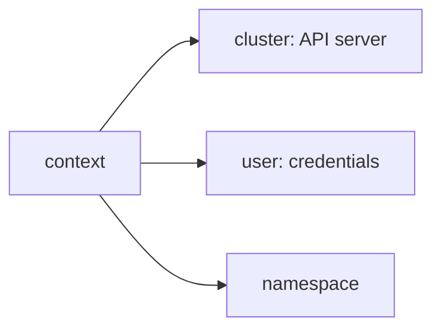

# Переключение контекстов в Kubernetes

Контекст Kubernetes определяет, куда `kubectl` отправит команду: в какой кластер, от имени какого пользователя и в каком namespace по умолчанию.

Это особенно важно, когда на рабочей машине есть доступ к нескольким окружениям: `dev`, `stage`, `prod`, локальному `kind` или тестовому кластеру.

## Где хранится конфигурация

По умолчанию `kubectl` читает конфигурацию из файла:

```bash
~/.kube/config
```

Путь можно переопределить переменной окружения `KUBECONFIG`.

```bash
export KUBECONFIG=/path/to/config
kubectl config get-contexts
```

Файл `kubeconfig` обычно содержит четыре ключевые части:

- `clusters` - описания Kubernetes API server: имя кластера, адрес сервера, CA.
- `users` - учетные данные для доступа: сертификаты, токены, exec-плагины, cloud-auth.
- `contexts` - связки cluster + user + namespace.
- `current-context` - контекст, который используется по умолчанию.

Упрощенная схема:



## Посмотреть текущий контекст

```bash
kubectl config current-context
```

Пример:

```text
prod-admin
```

Это имя текущего context из `kubeconfig`. Само по себе оно не гарантирует, что вы понимаете, какой API server и namespace за ним стоят, поэтому перед изменяющими командами лучше проверить детали.

## Посмотреть список контекстов

```bash
kubectl config get-contexts
```

Пример вывода:

```text
CURRENT   NAME          CLUSTER       AUTHINFO      NAMESPACE
          dev-admin     dev-cluster   dev-user      default
*         prod-admin    prod-cluster  prod-user     backend
          kind-local    kind-kind     kind-user
```

Звездочка в колонке `CURRENT` показывает активный контекст.

## Переключить контекст

```bash
kubectl config use-context dev-admin
```

После переключения проверьте результат:

```bash
kubectl config current-context
kubectl config get-contexts
```

Команда меняет `current-context` в используемом `kubeconfig`. Все последующие команды `kubectl`, если не указать `--context`, пойдут в новый активный контекст.

## Выполнить команду в другом контексте без переключения

Для разовой команды можно указать контекст явно:

```bash
kubectl --context dev-admin get pods
kubectl --context prod-admin get deploy -n backend
```

Так удобнее проверять данные в другом окружении, не меняя глобальный текущий контекст в файле.

## Сменить namespace текущего контекста

Namespace по умолчанию можно задать в текущем контексте:

```bash
kubectl config set-context --current --namespace=backend
```

Проверить:

```bash
kubectl config get-contexts
kubectl get pods
```

После этого команды без `-n` будут выполняться в namespace `backend`.

Для разовой команды namespace лучше передавать явно:

```bash
kubectl get pods -n monitoring
```

## Создать или изменить context

Context связывает cluster, user и namespace:

```bash
kubectl config set-context dev-backend \
  --cluster=dev-cluster \
  --user=dev-user \
  --namespace=backend
```

Переключиться на него:

```bash
kubectl config use-context dev-backend
```

Если context с таким именем уже есть, `set-context` изменит его поля.

## Посмотреть детали kubeconfig

Полный kubeconfig:

```bash
kubectl config view
```

Только текущий контекст:

```bash
kubectl config view --minify
```

Посмотреть API server текущего контекста:

```bash
kubectl config view --minify -o jsonpath='{.clusters[0].cluster.server}{"\n"}'
```

Посмотреть namespace текущего контекста:

```bash
kubectl config view --minify -o jsonpath='{.contexts[0].context.namespace}{"\n"}'
```

Если namespace не указан, Kubernetes использует `default`.

## Несколько kubeconfig-файлов

`KUBECONFIG` может содержать несколько файлов, разделенных двоеточием в Linux и macOS:

```bash
export KUBECONFIG=~/.kube/config:~/.kube/dev.yaml:~/.kube/prod.yaml
kubectl config get-contexts
```

`kubectl` объединит данные из этих файлов при чтении.

Чтобы сохранить объединенный конфиг в отдельный файл:

```bash
kubectl config view --flatten > ~/.kube/merged-config
```

После этого можно использовать его отдельно:

```bash
export KUBECONFIG=~/.kube/merged-config
kubectl config get-contexts
```

## Проверка перед опасными командами

Перед командами вроде `delete`, `scale`, `rollout restart`, `apply` в production-кластере полезно проверить минимум четыре вещи.

Текущий контекст:

```bash
kubectl config current-context
```

API server:

```bash
kubectl config view --minify -o jsonpath='{.clusters[0].cluster.server}{"\n"}'
```

Namespace:

```bash
kubectl config view --minify -o jsonpath='{.contexts[0].context.namespace}{"\n"}'
```

Права текущего пользователя:

```bash
kubectl auth can-i delete pods -n backend
kubectl auth can-i apply -f deployment.yaml -n backend
```

Для особо рискованных действий лучше явно указывать context и namespace в самой команде:

```bash
kubectl --context prod-admin -n backend get deploy
kubectl --context prod-admin -n backend rollout status deploy/api
```

## Полезные приемы

Показать все namespace:

```bash
kubectl get ns
```

Проверить, куда реально идет запрос:

```bash
kubectl cluster-info
```

Переименовать context:

```bash
kubectl config rename-context old-name new-name
```

Удалить context из kubeconfig:

```bash
kubectl config delete-context old-name
```

Удаление context не удаляет кластер и не удаляет ресурсы в Kubernetes. Оно только убирает запись из локального `kubeconfig`.

## kubectx и kubens

Для частого переключения можно использовать внешние утилиты `kubectx` и `kubens`.

- `kubectx` ускоряет выбор context.
- `kubens` ускоряет выбор namespace.

Они удобны для интерактивной работы, но базовые команды `kubectl config` полезно знать в любом случае: они доступны без дополнительных инструментов и лучше показывают, что именно меняется в `kubeconfig`.

## Шпаргалка

| Действие | Команда |
| --- | --- |
| Показать текущий context | `kubectl config current-context` |
| Показать все contexts | `kubectl config get-contexts` |
| Переключить context | `kubectl config use-context <context>` |
| Выполнить команду в context без переключения | `kubectl --context <context> get pods` |
| Сменить namespace текущего context | `kubectl config set-context --current --namespace=<namespace>` |
| Создать или изменить context | `kubectl config set-context <name> --cluster=<cluster> --user=<user> --namespace=<namespace>` |
| Показать текущий kubeconfig-фрагмент | `kubectl config view --minify` |
| Показать API server текущего context | `kubectl config view --minify -o jsonpath='{.clusters[0].cluster.server}{"\n"}'` |
| Проверить права | `kubectl auth can-i <verb> <resource> -n <namespace>` |
| Использовать другой kubeconfig | `KUBECONFIG=/path/to/config kubectl get pods` |
