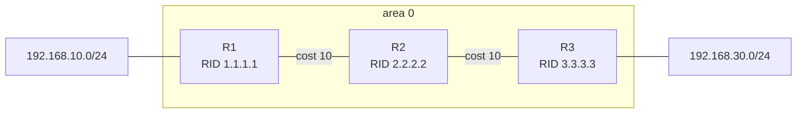

# OSPF: устройство, настройка и диагностика

OSPF (Open Shortest Path First) — внутренний протокол маршрутизации (Interior Gateway Protocol, IGP) класса link-state. Он работает внутри автономной системы, распространяет сведения о состоянии каналов и рассчитывает лучшие пути по общей базе топологии. OSPF передает собственные пакеты прямо поверх IP с номером протокола `89`: TCP- и UDP-портов у него нет.[1]

Если [RIP](rip.md) сообщает соседям готовые маршруты и оценивает путь числом переходов, то OSPF распространяет описания связей. Каждый маршрутизатор строит граф своей области и сам вычисляет дерево кратчайших путей — Shortest Path First (SPF).

## Короткая модель работы

```text
Hello
  ↓
обнаружение соседа и проверка совместимости параметров
  ↓
состояние 2-Way и решение, нужна ли полная adjacency
  ↓
ExStart → Exchange → Loading при недостающих LSA
  ↓
Full: одинаковая LSDB области после сходимости
  ↓
расчет SPF от собственного Router ID
  ↓
установка лучших маршрутов в RIB
```

- **Neighbor** — обнаруженный соседний OSPF-маршрутизатор.
- **Adjacency** — соседство, для которого маршрутизаторы синхронизируют базы и обмениваются LSA.
- **LSA** (Link-State Advertisement) — объявление о состоянии связей или доступности сетей.
- **LSDB** (Link-State Database) — база LSA, из которой строится граф области.
- **SPF** — расчет дерева кратчайших путей алгоритмом Дейкстры.
- **RIB** (Routing Information Base) — таблица маршрутизации, куда OSPF предлагает рассчитанные маршруты.

После сходимости два маршрутизатора одной области имеют одинаковую LSDB этой области, но их SPF-деревья и итоговые next hop различаются: каждый строит дерево от самого себя.[1]

## Однообластная сеть



Все три маршрутизатора хранят LSDB области `0`. R1 рассчитывает путь к `192.168.30.0/24` через R2, а R3 — путь к `192.168.10.0/24` через R2.

## Основные сущности

| Сущность | Что означает |
| --- | --- |
| Router ID | 32-битный идентификатор маршрутизатора в OSPF-домене |
| Interface | Интерфейс, на котором запущен OSPF |
| Neighbor | Сосед, обнаруженный через Hello |
| Adjacency | Отношение между соседями с синхронизацией LSDB |
| Area | Область с собственной link-state-базой |
| LSA | Элемент информации о топологии или внешнем маршруте |
| LSDB | Совокупность актуальных LSA области |
| SPF tree | Дерево кратчайших путей от текущего маршрутизатора |
| Cost | Стоимость исходящего интерфейса или всего пути |

### Router ID

Router ID — 32-битное число, которое должно однозначно идентифицировать маршрутизатор внутри автономной системы.[1] Записывается оно как IPv4-адрес, например `1.1.1.1`, но не обязано быть адресом, по которому передается пользовательский трафик.

Практический порядок выбора:

1. Настроить Router ID явно.
2. Использовать стабильное значение, не зависящее от состояния физического интерфейса.
3. Проверить уникальность во всем OSPF-домене.
4. После изменения Router ID перезапустить OSPF-процесс или очистить процесс способом, предусмотренным реализацией.

Дублирование Router ID приводит к некорректной идентификации источника LSA и нестабильной работе. Автоматический алгоритм выбора зависит от реализации, поэтому в управляемой сети лучше задавать идентификатор явно.

## Hello и формирование соседства

OSPF отправляет Hello-пакеты, чтобы обнаруживать соседей и поддерживать их состояние. На broadcast- и point-to-point-сетях Hello обычно отправляется на `224.0.0.5` — AllSPFRouters.[1]

Для успешного соседства проверяют как минимум:

- одинаковый Area ID на общем канале;
- одинаковые Hello и Dead intervals;
- совместимый network type;
- совместимые параметры области, включая stub-флаг;
- одинаковые требования и ключи аутентификации;
- согласованную IP-подсеть там, где проверка маски применима;
- уникальные Router ID;
- отсутствие фильтрации IP protocol `89`.

RFC 2328 требует одинаковые HelloInterval и RouterDeadInterval у маршрутизаторов общего сегмента.[1] Значения по умолчанию зависят от типа сети и реализации: их нужно проверять на интерфейсе, а не считать универсальными.

### Состояния соседа

| Состояние | Что происходит |
| --- | --- |
| Down | От соседа давно не было информации |
| Attempt | Только NBMA: маршрутизатор активно пытается связаться с настроенным соседом |
| Init | Hello получен, но собственный Router ID еще не виден в Hello соседа |
| 2-Way | Подтверждена двусторонняя связь |
| ExStart | Выбираются master/slave и начальный DD sequence number |
| Exchange | Соседи обмениваются Database Description и описывают содержимое LSDB |
| Loading | Через Link State Request запрашиваются недостающие или более свежие LSA |
| Full | LSDB синхронизированы, сформирована полная adjacency |

Эти состояния и переходы определены машиной состояний соседства OSPF.[1]

`2-Way` не всегда означает ошибку. В broadcast-сегменте DROther-маршрутизаторы обычно не формируют полную adjacency друг с другом: они остаются `2-Way` и переходят в `Full` с DR и BDR. На point-to-point-соединении ожидается `Full`.

## Пакеты OSPF

| Тип | Название | Назначение |
| --- | --- | --- |
| 1 | Hello | Поиск и контроль состояния соседей, выбор DR/BDR |
| 2 | Database Description (DBD/DD) | Краткое описание содержимого LSDB |
| 3 | Link State Request (LSR) | Запрос конкретных LSA |
| 4 | Link State Update (LSU) | Передача одного или нескольких LSA |
| 5 | Link State Acknowledgment (LSAck) | Подтверждение получения LSA |

Не путайте **тип пакета OSPF**, **тип LSA** и **код маршрута** в таблице маршрутизации — это три разные классификации.

## LSA, LSDB и flooding

Каждый маршрутизатор создает собственные LSA и принимает более свежие LSA от соседей. Полученные объявления надежно распространяются — flooding — в пределах разрешенной области действия. Link State Update может переносить несколько LSA.[1]

Упрощенно синхронизация выглядит так:

1. Соседи сравнивают сводки LSDB через DBD.
2. Запрашивают недостающие или более свежие LSA через LSR.
3. Получают их в LSU.
4. Подтверждают прием через LSAck.
5. Помещают актуальные LSA в LSDB.
6. При значимом изменении пересчитывают SPF.

### Основные LSA OSPFv2

| Тип LSA | Название | Кто создает | Где распространяется | Что описывает |
| --- | --- | --- | --- | --- |
| 1 | Router-LSA | Каждый маршрутизатор | Внутри области | Связи и их стоимость для маршрутизатора |
| 2 | Network-LSA | DR сегмента | Внутри области | Маршрутизаторы broadcast- или NBMA (Non-Broadcast Multi-Access)-сети |
| 3 | Summary-LSA | ABR | Внутри целевой области | Сети из другой области |
| 4 | ASBR-summary-LSA | ABR | Внутри целевой области | Путь до ASBR |
| 5 | AS-external-LSA | ASBR | По OSPF-домену, кроме областей, где type 5 запрещен | Внешние сети |

RFC 2328 определяет Router-LSA как type 1, Network-LSA как type 2, summary-LSA как type 3 и 4, а AS-external-LSA как type 5.[1]

LSA типов 3 и 4 переносят **межобластную информацию**, но не пересекают границу области как один и тот же экземпляр. ABR создает отдельную Summary-LSA для целевой области, и дальше она распространяется только внутри этой области.[1]

Важно различать:

- `LSA type 3` — формат объявления межобластной сети;
- `O IA` — код межобластного маршрута в выводе FRRouting;
- `E1/E2` — способы расчета внешней метрики, а не типы LSA.

## SPF и выбор маршрута

SPF использует LSDB как ориентированный граф:

- вершины — маршрутизаторы и transit-сети;
- ребра — связи;
- вес ребра — OSPF cost исходящего интерфейса.

Маршрутизатор строит дерево с собой в корне и получает кратчайший путь к каждой достижимой сети. При равной стоимости реализация может установить несколько next hop — ECMP (Equal-Cost Multi-Path).

Сначала рассматриваются наиболее предпочтительные классы OSPF-маршрутов: intra-area, затем inter-area, затем внешние. Административная дистанция и сравнение с маршрутами других протоколов относятся уже к локальной политике RIB конкретной реализации.

## Метрика cost

OSPF суммирует cost исходящих интерфейсов по пути. В FRRouting автоматическая стоимость обратно пропорциональна пропускной способности интерфейса и заданной reference bandwidth.[3]

```text
cost = reference bandwidth / interface bandwidth
```

Обе величины должны быть выражены в одинаковых единицах. Результат зависит от правил округления и допустимого диапазона реализации; стоимость OSPF не должна становиться нулевой.

Пример с общей reference bandwidth `10 000 Мбит/с`:

```text
Интерфейс 1 Гбит/с:
10 000 / 1 000 = 10

Интерфейс 100 Мбит/с:
10 000 / 100 = 100
```

Reference bandwidth нужно настроить одинаково на всех маршрутизаторах домена, чтобы одинаковая политика назначения cost применялась ко всем исходящим интерфейсам. Маршрутизатор не пересчитывает стоимость удаленной связи по ее скорости: он использует cost, уже объявленный создавшим LSA маршрутизатором. Явная команда `ip ospf cost` переопределяет автоматически рассчитанное значение на конкретном интерфейсе.[3]

### Сравнение двух путей

```text
Путь A: R1 --10-- R2 --10-- R3 --10-- LAN-B
Итого: 10 + 10 + 10 = 30

Путь B: R1 --20-- R4 --20-- LAN-B
Итого: 20 + 20 = 40

OSPF выбирает путь A с cost 30.
```

Текущая загрузка, задержка и потери сами по себе cost не меняют. Если нужна другая политика, администратор меняет cost, reference bandwidth или архитектуру маршрутизации.

## Areas и многообластная архитектура

Area ограничивает распространение топологической информации и объем SPF-расчетов. ABR хранит отдельную LSDB и запускает отдельный расчет для каждой подключенной области.[1]

Area `0.0.0.0`, обычно записываемая как `area 0`, — backbone. Она связывает остальные области и переносит межобластную маршрутную информацию. RFC 2328 требует связности backbone; для временного логического восстановления предусмотрены virtual links, но нормальный проект строят с прямой устойчивой связностью area 0.[1]

```mermaid
flowchart LR
    subgraph AREA1[area 1]
        LANA[LAN-A<br/>192.168.10.0/24] --- R1[R1<br/>RID 1.1.1.1]
        R1 ---|10.0.12.0/30<br/>cost 10| R2E0[R2 eth0<br/>10.0.12.2]
    end

    R2E0 -. один ABR<br/>RID 2.2.2.2 .- R2E1

    subgraph AREA0[area 0]
        R2E1[R2 eth1<br/>10.0.23.1] ---|10.0.23.0/30<br/>cost 10| R3[R3<br/>RID 3.3.3.3]
        R3 --- LANB[LAN-B<br/>192.168.30.0/24]
    end
```

На схеме R2 имеет интерфейс в area 1 и интерфейс в area 0, поэтому является ABR. Граница area проходит по интерфейсам R2, а не «внутри канала».

### Типы маршрутизаторов

Роли могут пересекаться:[1]

- **Internal router** — все OSPF-интерфейсы находятся в одной области.
- **Backbone router** — имеет хотя бы один интерфейс в area 0.
- **ABR** (Area Border Router) — подключен к нескольким областям и передает между ними сводную информацию.
- **ASBR** (Autonomous System Boundary Router) — импортирует в OSPF маршруты из внешнего источника.

Один маршрутизатор может одновременно быть ABR, backbone router и ASBR.

### Типы маршрутов

| Код FRRouting | Класс | Смысл |
| --- | --- | --- |
| `O` | Intra-area | Рассчитан внутри текущей области |
| `O IA` | Inter-area | Получен через ABR из другой области |
| `O E1` | External type 1 | Внешняя метрика плюс внутренняя стоимость до ASBR |
| `O E2` | External type 2 | Сначала сравнивается внешняя метрика; при равенстве — внутренняя стоимость до ASBR или forwarding address |

NSSA-маршруты и LSA type 7 относятся к углубленному материалу и здесь подробно не рассматриваются.

## Network types

| Network type | Типичный канал | Автообнаружение | DR/BDR |
| --- | --- | --- | --- |
| Broadcast | Ethernet-сегмент с несколькими роутерами | Да | Да |
| Point-to-point | Канал между двумя роутерами | Да | Нет |
| NBMA (Non-Broadcast Multi-Access) | Multi-access без broadcast | Обычно нужны дополнительные настройки | Да |
| Point-to-multipoint | Набор p2p-связей | Зависит от реализации | Нет |

Network type влияет на Hello/Dead timers, обнаружение соседей, адреса отправки и выбор DR/BDR. Он должен соответствовать реальной топологии и быть совместимым на концах связи.

## DR и BDR

В broadcast- и NBMA-сетях OSPF выбирает:

- **DR** (Designated Router) — центральную точку adjacency и источник Network-LSA;
- **BDR** (Backup Designated Router) — резерв, готовый заменить DR.

Это уменьшает число полных adjacency. Вместо полной сетки каждый DROther формирует `Full` с DR и BDR; между собой DROther обычно остаются `2-Way`.[1]

При выборе учитываются:

1. Interface priority: большее значение предпочтительнее.
2. Priority `0`: маршрутизатор не может стать DR или BDR.
3. При равном ненулевом priority выигрывает больший Router ID.[1]

Выбор не является обычным непрерывным конкурсом. Уже работающий DR не уступает роль только потому, что позже появился маршрутизатор с большим priority. Для плановой смены роли нужно учитывать перезапуск соседства и возможное влияние на трафик.

Адреса OSPFv2 в broadcast-сегменте:

- `224.0.0.5` — AllSPFRouters, слушают все OSPF-маршрутизаторы;
- `224.0.0.6` — AllDRouters, слушают DR и BDR.

Оба адреса link-local по назначению: пакеты не должны маршрутизироваться за пределы сегмента, а RFC задает TTL `1`.[1]

## Passive interface

Passive interface позволяет анонсировать подключенную сеть, но не отправлять Hello и не формировать соседство на пользовательском LAN. Это полезно для:

- уменьшения лишнего служебного трафика;
- исключения неожиданных соседей на access-сегменте;
- сокращения поверхности атаки.

В FRRouting можно включить `passive-interface` для конкретного интерфейса либо сначала сделать пассивными все интерфейсы и явно исключить transit-соединения.[3]

Passive interface — не замена firewall и аутентификации. Нужно отдельно ограничивать IP protocol `89` на границах доверенной сети.

## Аутентификация и безопасность

OSPF следует запускать только на доверенных transit-сегментах и защищать control plane фильтрами и аутентификацией.

OSPFv2 из RFC 2328 определяет null, simple password и cryptographic authentication.[1] Simple password не обеспечивает современную криптографическую защиту: секрет не следует считать конфиденциальным. Конкретные доступные алгоритмы и команды зависят от реализации и версии; предпочтительны поддерживаемые криптографические механизмы и плановая ротация ключей.

В исходной спецификации OSPFv3 поля аутентификации удалены из OSPF-заголовка, а защита обмена возложена на механизмы IPv6 AH/ESP.[2] Более поздние расширения OSPFv3 нужно настраивать строго по документации используемой платформы, не перенося команды OSPFv2 механически.

Практические меры:

- не включать OSPF на внешних и пользовательских интерфейсах;
- применять passive interface на LAN без соседей;
- ограничивать protocol `89` ожидаемыми сегментами;
- использовать одинаковую политику аутентификации на обоих концах;
- хранить ключи вне публичной конфигурации и документации;
- контролировать появление новых Router ID и смену DR/BDR;
- не использовать в примерах реальные ключи.

## OSPFv2 и OSPFv3

| Свойство | OSPFv2 | OSPFv3 |
| --- | --- | --- |
| Основное назначение | Маршрутизация IPv4 | Изначально маршрутизация IPv6 |
| IP protocol | `89` | `89` |
| Работа | На IP-подсети | На link |
| Адрес соседства | IPv4-адрес интерфейса | Обычно IPv6 link-local |
| Multicast ко всем OSPF-роутерам | `224.0.0.5` | `FF02::5` |
| Multicast к DR/BDR | `224.0.0.6` | `FF02::6` |
| Передача префиксов | В базовых LSA OSPFv2 | В отдельных IPv6 prefix LSA |
| Защита в исходной RFC | Поля аутентификации OSPFv2 | Опора на IPv6 AH/ESP |

OSPFv3 сохраняет базовые механизмы flooding, DR election, areas и SPF, но меняет адресную семантику, работает на link и использует новые LSA для IPv6-адресов и префиксов.[2]

## Практический стенд на FRRouting

Ниже используется синтаксис **FRRouting 8.4.4**. Все три конфигурации проверены локально командой `vtysh -C -f <file>` из пакета Ubuntu `8.4.4-1.1ubuntu6.7`; проверка подтвердила синтаксис, но не имитировала работающую сеть. Диагностические команды сверены с документацией FRRouting 8.4.[3]

Предварительные требования к стенду:

- установлен FRRouting 8.4.4 с компонентами `zebra`, `ospfd` и `vtysh`;
- демоны `zebra` и `ospfd` включены и запущены;
- в ОС включена пересылка IPv4-пакетов;
- имена `eth0` и `eth1` заменены на реальные имена интерфейсов стенда;
- каждый transit-канал имеет L2/L3-связность согласно адресному плану.

### Топология и адресный план

```text
LAN-A              area 1               area 0              LAN-B
192.168.10.0/24                                              192.168.30.0/24
       |                                                     |
       R1 -------- 10.0.12.0/30 -------- R2 -------- 10.0.23.0/30 -------- R3
  10.0.12.1                         .2   .1                           .2
  RID 1.1.1.1                    RID 2.2.2.2                    RID 3.3.3.3
                                      ABR
```

| Устройство | Интерфейс | Адрес | Area | Cost | Назначение |
| --- | --- | --- | --- | --- | --- |
| R1 | `eth0` | `10.0.12.1/30` | 1 | 10 | Transit к R2 |
| R1 | `eth1` | `192.168.10.1/24` | 1 | 10 | LAN-A, passive |
| R2 | `eth0` | `10.0.12.2/30` | 1 | 10 | Transit к R1 |
| R2 | `eth1` | `10.0.23.1/30` | 0 | 10 | Transit к R3 |
| R3 | `eth0` | `10.0.23.2/30` | 0 | 10 | Transit к R2 |
| R3 | `eth1` | `192.168.30.1/24` | 0 | 10 | LAN-B, passive |

Transit-интерфейсы принудительно настроены как point-to-point, поэтому DR/BDR на них не выбираются. Явный cost делает лабораторный результат независимым от того, какую скорость сообщит виртуальный интерфейс.

Перед применением конфигурации FRR адреса интерфейсов должны соответствовать таблице. В интегрированной конфигурации их можно задать через FRR, как показано ниже, либо заранее настроить средствами ОС — не делайте оба варианта одновременно без необходимости.

### Конфигурация R1

```frr
frr version 8.4
frr defaults traditional
hostname R1
service integrated-vtysh-config
!
interface eth0
 ip address 10.0.12.1/30
 ip ospf network point-to-point
 ip ospf cost 10
!
interface eth1
 ip address 192.168.10.1/24
 ip ospf cost 10
!
router ospf
 ospf router-id 1.1.1.1
 auto-cost reference-bandwidth 10000
 network 10.0.12.0/30 area 0.0.0.1
 network 192.168.10.0/24 area 0.0.0.1
 passive-interface eth1
!
line vty
!
```

### Конфигурация R2

```frr
frr version 8.4
frr defaults traditional
hostname R2
service integrated-vtysh-config
!
interface eth0
 ip address 10.0.12.2/30
 ip ospf network point-to-point
 ip ospf cost 10
!
interface eth1
 ip address 10.0.23.1/30
 ip ospf network point-to-point
 ip ospf cost 10
!
router ospf
 ospf router-id 2.2.2.2
 auto-cost reference-bandwidth 10000
 network 10.0.12.0/30 area 0.0.0.1
 network 10.0.23.0/30 area 0.0.0.0
!
line vty
!
```

### Конфигурация R3

```frr
frr version 8.4
frr defaults traditional
hostname R3
service integrated-vtysh-config
!
interface eth0
 ip address 10.0.23.2/30
 ip ospf network point-to-point
 ip ospf cost 10
!
interface eth1
 ip address 192.168.30.1/24
 ip ospf cost 10
!
router ospf
 ospf router-id 3.3.3.3
 auto-cost reference-bandwidth 10000
 network 10.0.23.0/30 area 0.0.0.0
 network 192.168.30.0/24 area 0.0.0.0
 passive-interface eth1
!
line vty
!
```

Проверка файла до применения:

```bash
sudo vtysh -C -f /etc/frr/frr.conf
```

После успешной проверки конфигурацию применяют принятым в окружении способом. Не перезапускайте FRR на production-маршрутизаторе без плана изменения и отката.

## Проверка стенда

Войти в оболочку:

```bash
sudo vtysh
```

Проверить общую информацию и интерфейсы:

```text
show ip ospf
show ip ospf interface
show ip ospf interface eth0
```

Проверить соседей:

```text
show ip ospf neighbor
show ip ospf neighbor detail
```

Ожидания:

- R1 видит R2 в `Full` через `eth0`;
- R2 видит R1 и R3 в `Full`;
- R3 видит R2 в `Full`;
- на `eth1` R1 и R3 соседей нет, потому что интерфейсы passive.

Проверить LSDB:

```text
show ip ospf database
show ip ospf database router
show ip ospf database summary
```

На point-to-point transit-сегментах Network-LSA type 2 не требуется. Router-LSA type 1 присутствует для маршрутизаторов каждой области, а R2 создает summary-LSA type 3 для передачи межобластной информации.

Проверить OSPF-маршруты:

```text
show ip ospf route
show ip route ospf
show ip route 192.168.30.0/24
```

На R1 сеть LAN-B должна появиться как inter-area-маршрут через `10.0.12.2`. Типичный вид строки — только ориентир, точное форматирование зависит от сборки:

```text
O IA 192.168.30.0/24 ... via 10.0.12.2, eth0
```

### Ручная проверка cost

От R1 до LAN-B учитываются:

```text
R1 → R2:       10
R2 → R3:       10
R3 → LAN-B:    10
Итого:         30
```

Сверить рассчитанное значение можно так:

```text
show ip route 192.168.30.0/24
show ip ospf route
```

Не включайте в сумму обратный cost интерфейса: OSPF использует стоимость исходящего направления каждого ребра.

### Проверка отказа

В тестовой среде отключить канал R2–R3 на R2:

```bash
sudo ip link set eth1 down
```

Проверить:

```text
show ip ospf neighbor
show ip route 192.168.30.0/24
show ip ospf database
```

После обнаружения отказа соседство R2–R3 перейдет в Down или исчезнет из вывода. Так как резервного пути в схеме нет, inter-area-маршрут к `192.168.30.0/24` на R1 будет удален после сходимости.

Вернуть канал:

```bash
sudo ip link set eth1 up
```

После восстановления должны повториться Hello, формирование adjacency, синхронизация LSDB и установка маршрута. Изменяющие команды выполняйте только в лаборатории или в согласованное окно работ.

## Диагностика соседства

Идите снизу вверх и не начинайте с перезапуска процесса.

### Шаг 1. Интерфейс и IP-связность

```bash
ip -br address
ip -s link show dev eth0
ping -c 3 10.0.12.2
```

```text
show ip ospf interface eth0
```

Проверьте состояние `UP`, адрес, маску и участие интерфейса в OSPF.

### Шаг 2. Area ID

Симптом: Hello видны, но соседство не развивается.

```text
show running-config
show ip ospf interface eth0
```

Оба конца общего канала должны относить интерфейс к одной области.

### Шаг 3. Hello и Dead intervals

Симптом: сосед отсутствует или постоянно сбрасывается.

```text
show ip ospf interface eth0
```

Сравните интервалы на обоих концах. Не исправляйте проблему слепой установкой «типичных» `10/40`: значения зависят от network type и конфигурации.

### Шаг 4. Network type

Симптом: соседство не формируется либо поведение DR/BDR не соответствует ожиданию.

```text
show ip ospf interface eth0
```

На обеих сторонах должен быть совместимый тип. Для прямого лабораторного Ethernet-канала в примере явно выбран `point-to-point`.

### Шаг 5. Аутентификация

Симптом: сосед игнорируется, хотя IP-связность и timers корректны.

Проверьте режим, key ID, алгоритм и наличие одинакового действующего ключа. Не выводите секрет в тикет, лог или публичную wiki.

### Шаг 6. Router ID

Симптом: нестабильные LSA, сообщения о duplicate Router ID или неожиданное исчезновение соседа.

```text
show ip ospf
show ip ospf neighbor
show ip ospf database router
```

Найдите дубликат и назначьте каждому маршрутизатору уникальный стабильный Router ID.

### Шаг 7. MTU и ExStart/Exchange

Симптом: сосед долго остается в `ExStart` или `Exchange`.

```bash
ip link show dev eth0
```

```text
show ip ospf interface eth0
show ip ospf neighbor detail
```

DBD содержит Interface MTU; пакет отвергается, если заявленный размер превышает размер, который принимающая сторона может получить без фрагментации.[1] Исправляйте реальное несоответствие MTU. Обход проверки допустим только как осознанная временная мера, если это поддерживает реализация.

### Шаг 8. Passive interface, списки доступа и protocol 89

Симптом: интерфейс объявляет сеть, но Hello не отправляется, либо пакеты видны только с одной стороны.

```text
show running-config
show ip ospf interface eth0
```

```bash
sudo tcpdump -ni eth0 'ip proto 89'
```

Проверьте passive-настройку, ACL (Access Control List — список контроля доступа) и другие фильтры в обоих направлениях. Не ищите UDP-порт OSPF — его нет.

### Шаг 9. LSDB

Симптом: сосед `Full`, но ожидаемой сети нет.

```text
show ip ospf database
show ip ospf database router
show ip ospf database summary
show ip ospf database external
```

Определите, существует ли нужная LSA, кто ее Advertising Router и в какой области она должна распространяться.

### Шаг 10. RIB

Симптом: LSA есть, но маршрут не установлен.

```text
show ip ospf route
show ip route 192.168.30.0/24
show ip route
```

Проверьте SPF-результат, достижимость next hop и наличие более предпочтительного маршрута из другого источника.

### Таблица типовых проблем

| Симптом | Вероятная причина | Что проверить |
| --- | --- | --- |
| Соседа нет | OSPF не включен, passive, protocol 89 заблокирован | Interface config, tcpdump, ACL |
| Застрял в Init | Односторонняя передача Hello | Multicast, ACL, L2 |
| Остался 2-Way | Нормально для пары DROther либо adjacency не нужна | Роли DR/BDR и network type |
| Застрял ExStart/Exchange | MTU, duplicate Router ID, нестабильный канал | MTU, RID, ошибки интерфейса |
| Сосед периодически падает | Timer mismatch, потери, перегрузка control plane | Timers, counters, CPU, packet capture |
| Full, но сети нет | Нет нужной LSA или неверная area/redistribution | LSDB и Advertising Router |
| LSA есть, маршрута нет | SPF/RIB предпочел другой путь или next hop недоступен | OSPF route и общая RIB |
| Неожиданный DR | Выбор уже состоялся до появления более высокого priority | Uptime соседства, priority, RID |

## Краткая шпаргалка

```text
Класс:                   link-state IGP
IP protocol:             89
OSPFv2:                  IPv4
OSPFv3:                  первоначально IPv6
AllSPFRouters v2:        224.0.0.5
AllDRouters v2:          224.0.0.6
AllSPFRouters v3:        FF02::5
AllDRouters v3:          FF02::6
Backbone:                area 0 / 0.0.0.0
Финальное соседство:     Full
Нормальное DROther↔DROther: 2-Way
Расчет пути:             SPF, алгоритм Дейкстры
Метрика пути:            сумма cost исходящих интерфейсов
DR/BDR:                  broadcast и NBMA
Priority 0:              не участвует в выборе DR/BDR
```

Порядок диагностики:

```text
link/IP → area → timers → network type → auth → Router ID
→ MTU → passive/ACL → LSDB → SPF/RIB
```

Главная идея OSPF:

> Сначала синхронизируй с соседями карту связей своей области, затем самостоятельно рассчитай кратчайшие пути от себя.

## Sources

[1]: https://www.rfc-editor.org/rfc/rfc2328.txt "RFC 2328: OSPF Version 2"
[2]: https://www.rfc-editor.org/rfc/rfc5340.txt "RFC 5340: OSPF for IPv6"
[3]: https://docs.frrouting.org/en/stable-8.4/ospfd.html "FRRouting 8.4 OSPFv2 documentation"
