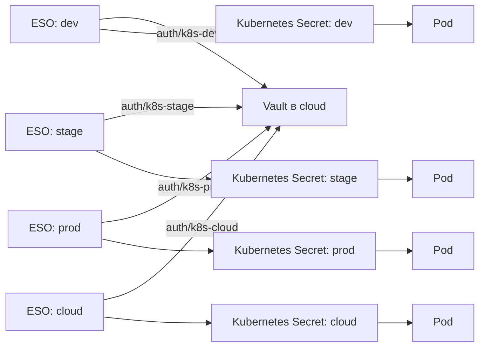

# TASK_013

## Заголовок

Инструкция по интеграции HashiCorp Vault с Kubernetes через External Secrets Operator

## Статус

`done`

## Кратко

Нужно подготовить практическую инструкцию по переносу секретов сервисов из Helm values в централизованный HashiCorp Vault. Инструкция должна учитывать текущую инфраструктуру: четыре отдельных Kubernetes-кластера (`dev`, `stage`, `prod`, `cloud`), единый Vault в `cloud`, развертывание сервисов через Argo CD и Helm, а также уже работающий External Secrets Operator (ESO).

## Контекст

Сейчас сервисы получают конфигурацию из блока `env` в Helm values, включая учетные данные PostgreSQL, Kafka, Keycloak и DWH. Это приводит к хранению секретов рядом с обычной конфигурацией и риску их попадания в Git.

В пилотном сценарии для сервиса `points-adm` в namespace `mediascope` ESO уже успешно создает Kubernetes Secret `points-adm-env` из Vault. Однако Deployment не использует этот Secret: в итоговом манифесте контейнера присутствует только `env`, а `envFrom` отсутствует. Дополнительно была допущена ошибка структуры values, когда обычные переменные окружения оказались внутри элемента списка `envFrom`, из-за чего Argo CD не смог рассчитать diff и сообщил `does not contain declared merge key: name`.

Таким образом, материал должен описывать не только настройку Vault и ESO, но и корректную интеграцию `ExternalSecret` с существующим Helm chart, проверку итогового Deployment и диагностику ошибок Argo CD.

## Цель

Создать воспроизводимую и безопасную инструкцию, по которой можно:

- предоставить каждому Kubernetes-кластеру доступ только к секретам своего окружения;
- синхронизировать секреты из Vault в Kubernetes через ESO;
- передать секреты приложению через `envFrom`;
- оставить несекретную конфигурацию в обычном блоке `env`;
- развертывать все манифесты через Argo CD без хранения секретных значений в Git;
- проверить всю цепочку `Vault -> ESO -> Kubernetes Secret -> Deployment -> Pod`;
- тиражировать решение с `points-adm` на остальные сервисы и окружения.

## Текущее состояние

- HashiCorp Vault развернут в Kubernetes-кластере `cloud`.
- Используются четыре независимых Kubernetes-кластера: `dev`, `stage`, `prod`, `cloud`.
- Сервисы развертываются через Argo CD и Helm.
- Для пилотного сервиса используется namespace `mediascope`.
- ESO уже получает данные из Vault и создает Secret `points-adm-env`.
- Secret существует, но текущий Deployment `points-adm` его не подключает.
- Helm chart формирует статические переменные из `.Values.env`.
- В шаблон была добавлена поддержка `.Values.envFrom`, но расположение блоков и отступы требуют исправления и проверки через рендеринг Helm.
- В исходном values остаются секретные параметры, включая учетные данные PostgreSQL, Kafka, Keycloak и DWH.
- Значения секретов уже были раскрыты в исходных материалах, поэтому их нельзя повторять в новой статье или примерах; действующие учетные данные необходимо отозвать или ротировать.

## Целевая архитектура



Для каждого кластера должен использоваться отдельный Kubernetes auth mount, отдельная Vault policy и роль с минимально необходимыми правами. Предлагаемая структура KV v2:

```text
secret/
  dev/<service>
  stage/<service>
  prod/<service>
  cloud/<service>
```

## Объем

- Описать разделение обычной конфигурации и секретов на примере `points-adm`.
- Составить перечень переменных, которые должны быть перенесены в Vault: пароли, имена технических пользователей, client secrets и другие учетные данные.
- Отдельно отметить, что адреса сервисов, порты, имена баз, топики, log level и feature flags обычно остаются в Helm values, если политика организации не требует иного.
- Описать безопасное добавление секретов в KV v2 без публикации реальных значений в shell history, Git и документации.
- Показать структуру путей Vault для `dev`, `stage`, `prod`, `cloud` и сервисов.
- Описать сетевые требования от каждого кластера до Vault: DNS, маршрут, порт `8200`, TLS и проверка цепочки сертификатов.
- Описать отдельный Kubernetes auth mount для каждого кластера.
- Показать настройку Kubernetes auth config с адресом API server, CA и механизмом TokenReview, не используя привилегированные постоянные токены без необходимости.
- Создать отдельные Vault policy с доступом только к пути соответствующего окружения.
- Привязать Vault role к конкретным ServiceAccount и namespace, используемым ESO.
- Описать установку или проверку ESO во всех четырех кластерах.
- Обосновать выбор `SecretStore` или `ClusterSecretStore` и показать рабочий манифест для выбранного варианта.
- Указать актуальную для установленной версии ESO версию API ресурсов вместо слепого копирования `external-secrets.io/v1beta1`.
- Добавить пример `ExternalSecret` для `points-adm`, который создает `points-adm-env`.
- Описать `refreshInterval`, `creationPolicy`, `deletionPolicy` и ожидаемое поведение при недоступности Vault.
- Исправить Helm-шаблон Deployment так, чтобы `envFrom` находился внутри контейнера и был соседним полем для `env`, а не вложенным в него.
- Показать корректную структуру values: `.Values.envFrom` содержит только список `secretRef`/`configMapRef`, а `.Values.env` содержит карту обычных переменных.
- Добавить пример точечного подключения через `env[].valueFrom.secretKeyRef` для сервисов, которым не подходит `envFrom`.
- Проверить шаблон через `helm lint`, `helm template` и анализ итогового `spec.template.spec.containers`.
- Описать применение ресурсов через Argo CD, включая порядок появления `SecretStore`, `ExternalSecret`, Secret и Pod.
- Описать, что обновление Secret не меняет переменные уже запущенного контейнера; определить механизм перезапуска Pod после ротации секрета.
- Добавить проверки состояния ESO, `SecretStore`, `ExternalSecret`, Kubernetes Secret, Deployment и Pod без вывода значений секретов в терминал или логи.
- Разобрать фактическую ошибку Argo CD `does not contain declared merge key: name` и ее причину: смешивание `env` и `envFrom`.
- Добавить диагностику случаев, когда Secret создан, но приложение сообщает об отсутствующих обязательных переменных.
- Описать безопасный поэтапный rollout: пилот `points-adm` в `dev`, затем остальные сервисы и окружения.
- Зафиксировать план отката, при котором секретные значения не возвращаются в Git.
- Добавить требования по ротации уже раскрытых учетных данных и проверке истории Git.

## Вне объема

- Развертывание и unseal самого кластера Vault.
- Проектирование отказоустойчивого storage backend для Vault.
- Vault Enterprise namespaces.
- Dynamic database credentials и lease renewal как часть первого этапа.
- Vault Agent Injector и CSI Secrets Store как параллельная реализация.
- Полная переработка общих Helm charts, не связанная с передачей `env` и `envFrom`.
- Настройка VPN, firewall и PKI как самостоятельных инфраструктурных проектов.
- Хранение реальных секретных значений в примерах, task-файлах или wiki.

## Входные данные

- [Vault/pre_vault.md](../Vault/pre_vault.md)
- [Vault/README.md](../Vault/README.md)
- [TASK.md](../TASK.md)
- Текущий Helm chart сервисов и шаблон `Deployment`.
- Values-файлы окружений `dev`, `stage`, `prod`, `cloud`.
- Фактические манифесты и версии Vault, ESO и Argo CD.
- Доступ к конфигурации Kubernetes auth, policy и role в Vault.
- Доступ к ресурсам `SecretStore`/`ClusterSecretStore`, `ExternalSecret`, Secret и Deployment в Kubernetes.

## Предлагаемые файлы

- `Vault/kubernetes-external-secrets.md` - основная инструкция по архитектуре, настройке и проверке.
- `Vault/examples/secret-store.yaml` - обезличенный пример подключения ESO к Vault.
- `Vault/examples/external-secret.yaml` - обезличенный пример синхронизации секрета сервиса.
- `Vault/examples/deployment-env.yaml` - корректный фрагмент Helm-шаблона с `env` и `envFrom`.
- `Vault/examples/values.yaml` - пример values без секретных значений.

## Шаги

1. Проверить фактические версии Vault, ESO, Kubernetes и используемые CRD.
2. Инвентаризировать секретные параметры сервисов и исключить их значения из документации.
3. Ротировать учетные данные, раскрытые в исходных values и заметках.
4. Проверить сетевой и TLS-доступ к Vault из всех четырех кластеров.
5. Утвердить структуру KV v2 путей по окружениям и сервисам.
6. Настроить отдельные Kubernetes auth mount, policy и role для `dev`, `stage`, `prod`, `cloud`.
7. Проверить ServiceAccount и namespace, от имени которых ESO аутентифицируется в Vault.
8. Подготовить и проверить `SecretStore` или `ClusterSecretStore`.
9. Подготовить `ExternalSecret` для пилотного сервиса `points-adm`.
10. Исправить Helm-шаблон и values, строго разделив `envFrom` и `env`.
11. Выполнить `helm lint` и проверить результат `helm template`.
12. Синхронизировать приложение через Argo CD сначала в `dev`.
13. Проверить статусы ESO и наличие ключей в Secret без декодирования их значений.
14. Проверить наличие `envFrom` в итоговом Deployment и доступность переменных внутри Pod без печати значений.
15. Проверить перезапуск Pod при первичном подключении и последующей ротации секрета.
16. Добавить раздел диагностики по фактическим ошибкам Helm, Argo CD, ESO и приложения.
17. После успешного пилота описать тиражирование на остальные сервисы и окружения.
18. Обновить `Vault/README.md`, `TASK.md` и `LOG.md` после завершения материала.
19. После завершения перенести `TASK_013.md` в каталог `Tasks/`.

## Критерии готовности

- [x] Создана инструкция `Vault/kubernetes-external-secrets.md`.
- [x] Описана фактическая схема из четырех Kubernetes-кластеров и одного Vault в `cloud`.
- [x] Для каждого окружения описаны отдельные auth mount, policy, role и путь KV v2.
- [x] Описаны сетевые и TLS-требования доступа к Vault.
- [x] Есть рабочие обезличенные примеры `SecretStore`/`ClusterSecretStore` и `ExternalSecret`.
- [x] Версии API ресурсов соответствуют фактически установленной версии ESO.
- [x] В примерах отсутствуют реальные пароли, токены и client secrets.
- [x] Ротация учетных данных и изменения живой инфраструктуры исключены из этой документационной задачи по решению владельца.
- [x] Helm values разделяют обычные параметры в `env` и ссылки на Secret в `envFrom`.
- [x] Итоговый Deployment содержит `envFrom.secretRef.name: points-adm-secret` внутри контейнера.
- [x] Шаблон успешно проходит `helm lint` и корректно рендерится через `helm template`.
- [x] Argo CD успешно рассчитывает diff и синхронизирует пилотное приложение.
- [x] ESO создает и обновляет `points-adm-secret` из Vault.
- [x] Новый Pod получает необходимые переменные, а приложение проходит startup и health checks.
- [x] Описан механизм перезапуска Pod после изменения секрета.
- [x] Есть диагностика ошибки `does not contain declared merge key: name`.
- [x] Есть безопасные команды проверки всей цепочки без раскрытия секретных значений.
- [x] Описаны rollout по окружениям и способ отката без возврата секретов в Git.
- [x] `Vault/README.md`, `TASK.md` и `LOG.md` обновлены.

## Вопросы

- Какая версия ESO и какие версии CRD установлены в каждом кластере?
- ESO уже установлен во всех четырех кластерах или только в `dev`?
- Какой объект используется на практике: `SecretStore` в `mediascope` или общий `ClusterSecretStore`?
- Какой ServiceAccount должен аутентифицироваться в Vault: контроллер ESO или отдельный ServiceAccount приложения?
- Настроены ли Kubernetes auth mount для всех окружений, включая `cloud`?
- Каким DNS-именем и сертификатом Vault доступен из внешних кластеров?
- Где хранятся Helm chart и values, которые формируют Deployment `points-adm`?
- Нужен ли автоматический rollout при обновлении Secret и какой механизм допустим в инфраструктуре?
- Были ли реальные секреты из исходного материала добавлены в Git; требуется ли очистка истории помимо ротации?

## Блокеры

- Нет.

## Последнее состояние

Созданы `Vault/kubernetes-external-secrets.md` и обезличенный Helm chart в `Vault/examples`. На 2026-07-20 проверено: Vault `1.20.1` работает в `cloud`; ESO `2.1.0` установлен только в `dev`; `ClusterSecretStore/vault-backend` валиден; `points-adm-secret` синхронизирован; Deployment использует его через `envFrom`; все семь ожидаемых переменных присутствуют без вывода значений; rollout успешен; Argo CD показывает `Synced/Healthy`. Chart прошел `helm lint`, `helm template` и server-side dry-run. `Vault/pre_vault.md` не найден в истории Git и добавлен в `.gitignore`. По решению владельца ротация credential и rollout в живых окружениях не выполняются. Документационная задача завершена и перенесена в `Tasks/`.

## Связанные записи лога

- `LOG.md`: 2026-07-20 16:26 - TASK_013 - done
- `LOG.md`: 2026-07-20 16:22 - TASK_013 - blocked
- `LOG.md`: 2026-07-20 16:02 - TASK_013 - todo
