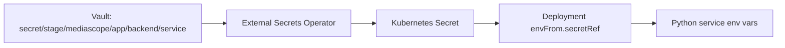

# План внедрения External Secrets + Vault на k8s-stage

## Целевая схема

Python-сервисы не ходят в Vault напрямую. Секреты читает External Secrets Operator, после чего они попадают в приложения как переменные окружения из Kubernetes Secret.



## 1. Проверить доступ к stage-кластеру

```sh
kubectl config get-contexts
kubectl config use-context <stage-context>
kubectl cluster-info
```

Ожидаемо: kubectl работает с нужным stage-кластером.

## 2. Установить External Secrets Operator

В репозитории уже есть chart:

- `/Users/asvetlakov/Work/repos/oro/argocd-dev/charts/external-secrets`
- `/Users/asvetlakov/Work/repos/oro/argocd-dev/charts/app-of-apps/templates/external-seсrets.yaml`
- `/Users/asvetlakov/Work/repos/oro/argocd-dev/values/infra/external-secrets.yaml`

Минимальные values:

```yaml
serviceAccount:
  name: "external-secrets"

installCRDs: false
```

Если CRD на stage ещё не установлены, установить их отдельно до запуска operator или временно включить установку CRD.

### 2.1. Установить CRD отдельно

Сначала проверить, какие CRD уже есть:

```sh
kubectl get crd | rg 'externalsecrets|secretstores|clustersecretstores|clusterexternalsecrets|pushsecrets'
```

Минимально для текущей схемы нужны:

```text
externalsecrets.external-secrets.io
secretstores.external-secrets.io
clustersecretstores.external-secrets.io
```

Так как в stage-репозитории лежит vendored chart `/Users/asvetlakov/Work/repos/oro/argocd-stage/charts/external/releases/external-secrets`, предпочтительный вариант - отрендерить CRD из этого же chart, чтобы версия CRD совпадала с версией operator.

В этом chart CRD лежат в `templates/crds/`, поэтому сырые файлы нельзя применять через `kubectl apply` напрямую: сначала их нужно отрендерить Helm'ом.

Вариант A: отрендерить и применить минимальный набор CRD для текущей схемы:

```sh
helm template external-secrets \
  /Users/asvetlakov/Work/repos/oro/argocd-stage/charts/external/releases/external-secrets \
  --namespace external-secrets \
  --set installCRDs=true \
  --show-only templates/crds/externalsecret.yaml \
  --show-only templates/crds/secretstore.yaml \
  --show-only templates/crds/clustersecretstore.yaml \
  > /tmp/external-secrets-crds.yaml

kubectl apply -f /tmp/external-secrets-crds.yaml
```

Предварительно проверить, что в файле только CRD:

```sh
rg '^kind: CustomResourceDefinition|^  name:' /tmp/external-secrets-crds.yaml
```

Ожидаемые CRD:

```text
externalsecrets.external-secrets.io
secretstores.external-secrets.io
clustersecretstores.external-secrets.io
```

Вариант B: отрендерить все CRD, которые поставляются с chart. Это полезно, если на stage планируется использовать не только `ExternalSecret`, но и generator'ы, `PushSecret`, `ClusterExternalSecret` и другие возможности operator.

`helm --show-only` в этом chart не принимает директорию `templates/crds`, поэтому нужно передать каждый template-файл отдельно. Удобнее сгенерировать аргументы из списка файлов:

```sh
chart=/Users/asvetlakov/Work/repos/oro/argocd-stage/charts/external/releases/external-secrets
show_only_args=()

for f in "$chart"/templates/crds/*.yaml; do
  show_only_args+=(--show-only "templates/crds/$(basename "$f")")
done

helm template external-secrets "$chart" \
  --namespace external-secrets \
  --set installCRDs=true \
  "${show_only_args[@]}" \
  > /tmp/external-secrets-all-crds.yaml

kubectl apply -f /tmp/external-secrets-all-crds.yaml
```

Проверить, какие CRD попали в файл:

```sh
rg '^  name: .+external-secrets.io' /tmp/external-secrets-all-crds.yaml
```

Для stage-кластера может потребоваться дополнительная подготовка файла перед применением:

- большие CRD нельзя ставить обычным `kubectl apply`, потому что client-side apply добавляет annotation `kubectl.kubernetes.io/last-applied-configuration` и можно получить ошибку `metadata.annotations: Too long`;
- CRD `externalsecrets.external-secrets.io` из chart `2.1.0` содержит поле `spec.versions[].selectableFields`; если API server stage его не поддерживает, будет ошибка `unknown field "spec.versions[0].selectableFields"`.

В таком случае удалить `selectableFields` из отрендеренного файла и применить через server-side apply:

```sh
python3 - <<'PY'
import re
from pathlib import Path

src = Path("/tmp/external-secrets-all-crds.yaml")
dst = Path("/tmp/external-secrets-all-crds-stage.yaml")

data = src.read_text()
data = re.sub(
    r"\n      selectableFields:\n(?:        - jsonPath: .+\n)+",
    "\n",
    data,
)

dst.write_text(data)
PY

kubectl apply --server-side --force-conflicts \
  -f /tmp/external-secrets-all-crds-stage.yaml
```

После этого проверить, что три ключевые CRD появились:

```sh
kubectl get crd externalsecrets.external-secrets.io
kubectl get crd secretstores.external-secrets.io
kubectl get crd clustersecretstores.external-secrets.io
```

Вариант C: поставить CRD из upstream release External Secrets Operator. Этот вариант использовать только если известна версия operator в stage/repo:

```sh
kubectl apply -f https://raw.githubusercontent.com/external-secrets/external-secrets/<version>/deploy/crds/bundle.yaml
```

Где `<version>` - конкретный тег релиза, например `v0.x.y`. Не использовать `main`, чтобы не получить CRD несовместимой версии.

После установки CRD дождаться, что API их принял:

```sh
kubectl wait --for condition=Established crd/externalsecrets.external-secrets.io --timeout=60s
kubectl wait --for condition=Established crd/secretstores.external-secrets.io --timeout=60s
kubectl wait --for condition=Established crd/clustersecretstores.external-secrets.io --timeout=60s
```

Проверка:

```sh
kubectl -n external-secrets get pods
kubectl get crd | rg 'external-secrets|clustersecretstore|externalsecret'
```

Ожидаемо:

```text
external-secrets                  1/1 Running
external-secrets-cert-controller  1/1 Running
external-secrets-webhook          1/1 Running
```

## 3. Настроить Kubernetes auth в Vault для stage

Создать отдельный Vault auth mount для stage, например:

```text
k8s-stage
```

Если mount ещё не включён:

```sh
vault auth enable -path=k8s-stage kubernetes
```

Настроить auth backend на stage Kubernetes API:

```sh
vault write auth/k8s-stage/config \
  kubernetes_host="https://<stage-kubernetes-api>" \
  kubernetes_ca_cert=@ca.crt \
  token_reviewer_jwt="<reviewer-jwt>"
```

Значения `kubernetes_host`, `kubernetes_ca_cert` и `token_reviewer_jwt` должны быть получены именно из stage-кластера.

### 3.1. Получить `kubernetes_host`

Использовать текущий stage-context:

```sh
kubectl config current-context
kubectl config view --raw --minify \
  -o jsonpath='{.clusters[0].cluster.server}{"\n"}'
```

Сохранить в переменную:

```sh
K8S_HOST="$(kubectl config view --raw --minify -o jsonpath='{.clusters[0].cluster.server}')"
echo "$K8S_HOST"
```

Это значение пойдёт в Vault как `kubernetes_host`.

### 3.2. Получить `kubernetes_ca_cert`

Взять CA из kubeconfig текущего stage-context и сохранить в файл:

```sh
kubectl config view --raw --minify \
  -o jsonpath='{.clusters[0].cluster.certificate-authority-data}' \
  | python3 -c 'import base64,sys; sys.stdout.buffer.write(base64.b64decode(sys.stdin.read()))' \
  > /tmp/k8s-stage-ca.crt
```

Проверить, что это сертификат:

```sh
openssl x509 -in /tmp/k8s-stage-ca.crt -noout -subject -issuer -dates
```

Этот файл пойдёт в Vault как `kubernetes_ca_cert=@/tmp/k8s-stage-ca.crt`.

Если в kubeconfig вместо `certificate-authority-data` используется путь `certificate-authority`, посмотреть его так:

```sh
kubectl config view --raw --minify \
  -o jsonpath='{.clusters[0].cluster.certificate-authority}{"\n"}'
```

Тогда в `vault write` можно передать этот файл напрямую.

### 3.3. Получить `token_reviewer_jwt`

Для Vault Kubernetes auth нужен JWT service account, которому разрешено делать TokenReview.

В dev-кластере найдена такая схема:

```text
ServiceAccount:      external-secrets/vault-auth
ClusterRoleBinding:  vault-auth-tokenreview
ClusterRole:         system:auth-delegator
```

На stage стоит повторить эту же схему.

Создать namespace, service account и binding:

```sh
kubectl create namespace external-secrets --dry-run=client -o yaml | kubectl apply -f -

kubectl -n external-secrets create serviceaccount vault-auth \
  --dry-run=client -o yaml | kubectl apply -f -

kubectl create clusterrolebinding vault-auth-tokenreview \
  --clusterrole=system:auth-delegator \
  --serviceaccount=external-secrets:vault-auth \
  --dry-run=client -o yaml | kubectl apply -f -
```

Для Kubernetes 1.24+ лучше явно создать service account token Secret:

```sh
kubectl -n external-secrets apply -f - <<'EOF'
apiVersion: v1
kind: Secret
metadata:
  name: vault-auth-token
  annotations:
    kubernetes.io/service-account.name: vault-auth
type: kubernetes.io/service-account-token
EOF
```

Дождаться, пока controller заполнит token:

```sh
kubectl -n external-secrets get secret vault-auth-token \
  -o jsonpath='{.data.token}' \
  | python3 -c 'import base64,sys; print(base64.b64decode(sys.stdin.read()).decode())'
```

Сохранить token в переменную:

```sh
TOKEN_REVIEWER_JWT="$(kubectl -n external-secrets get secret vault-auth-token \
  -o jsonpath='{.data.token}' \
  | python3 -c 'import base64,sys; print(base64.b64decode(sys.stdin.read()).decode())')"
```

Проверить, что token может делать TokenReview:

```sh
kubectl auth can-i create tokenreviews.authentication.k8s.io \
  --as=system:serviceaccount:external-secrets:vault-auth
```

Ожидаемо:

```text
yes
```

### 3.4. Применить Vault Kubernetes auth config

После получения всех значений:

```sh
vault write auth/k8s-stage/config \
  kubernetes_host="$K8S_HOST" \
  kubernetes_ca_cert=@/tmp/k8s-stage-ca.crt \
  token_reviewer_jwt="$TOKEN_REVIEWER_JWT"
```

Проверить:

```sh
vault read auth/k8s-stage/config
```

## 4. Создать Vault policy для stage-секретов

Рекомендуемый path для Python-сервисов stage:

```text
secret/stage/mediascope/app/backend/<service-name>
```

Для KV v2 policy должна учитывать `data` и `metadata`:

```hcl
path "secret/data/stage/mediascope/app/backend/*" {
  capabilities = ["read"]
}

path "secret/metadata/stage/mediascope/app/backend/*" {
  capabilities = ["read", "list"]
}
```

Пример применения:

```sh
vault policy write mediascope-stage-backend-read mediascope-stage-backend-read.hcl
```

## 5. Создать Vault role для External Secrets

В dev используется role `app` со следующей логикой:

```text
audience:                         https://kubernetes.default.svc.cluster.local
bound_service_account_names:      [*]
bound_service_account_namespaces: [mediascope external-secrets]
token_policies:                   [dev-app-policy]
token_ttl:                        1h
alias_name_source:                serviceaccount_uid
```

Для stage нужно создать такую же role `app`, но на auth mount `k8s-stage` и со stage policy.

```sh
vault write auth/k8s-stage/role/app \
  alias_name_source=serviceaccount_uid \
  audience=https://kubernetes.default.svc.cluster.local \
  bound_service_account_names='*' \
  bound_service_account_namespaces='mediascope,external-secrets' \
  policies=mediascope-stage-backend-read \
  ttl=1h
```

Проверить:

```sh
vault read auth/k8s-stage/role/app
```

Ожидаемо:

```text
alias_name_source                           serviceaccount_uid
audience                                    https://kubernetes.default.svc.cluster.local
bound_service_account_names                 [*]
bound_service_account_namespaces            [mediascope external-secrets]
token_policies                              [mediascope-stage-backend-read]
token_ttl                                   1h
```

Важно: dev-compatible вариант с `bound_service_account_names='*'` разрешает использовать role `app` любому service account в namespaces `mediascope` и `external-secrets`. Это совпадает с dev, но шире, чем привязка только к `external-secrets/external-secrets`.

## 6. Создать ClusterSecretStore на stage

Манифест:

```yaml
apiVersion: external-secrets.io/v1
kind: ClusterSecretStore
metadata:
  name: vault-backend
spec:
  provider:
    vault:
      server: https://vault.oro.moscow
      path: secret
      version: v2
      auth:
        kubernetes:
          mountPath: k8s-stage
          role: app
          serviceAccountRef:
            name: external-secrets
            namespace: external-secrets
```

Применить:

```sh
kubectl apply -f clustersecretstore-vault-backend.yaml
```

Проверить:

```sh
kubectl get clustersecretstore vault-backend -o yaml
```

Ожидаемо:

```text
type: Ready
status: "True"
reason: Valid
message: store validated
```

## 7. Завести секреты сервисов в Vault

Пример для `validation-adm`:

```sh
vault kv put secret/stage/mediascope/app/backend/validation-adm \
  KEYCLOAK_CLIENT_ID=... \
  KEYCLOAK_CLIENT_SECRET=... \
  YANDEX_CAPTCHA_SECRET=...
```

Пример для `research-qma`:

```sh
vault kv put secret/stage/mediascope/app/backend/research-qma \
  KAFKA_CONN__USERNAME=... \
  KAFKA_CONN__PASSWORD=... \
  PG_CONN__USER=... \
  PG_CONN__PASSWORD=... \
  QMA_USERNAME=... \
  QMA_PASSWORD=... \
  SENTRY_DSN=...
```

Правило: каждый ключ в Vault станет env var в контейнере с таким же именем.

## 8. Настроить Helm values Python-сервисов

Для каждого сервиса добавить или проверить блок:

```yaml
secret:
  enabled: true
  vaultPath: stage/mediascope/app/backend/<service-name>
  targetName: <service-name>-secret

envFrom:
  - secretRef:
      name: <service-name>-secret
```

Важно:

- `vaultPath` указывается без `secret/data`;
- `secret` и KV version уже заданы в `ClusterSecretStore`;
- `targetName` должен совпадать с `envFrom.secretRef.name`.

Пример:

```yaml
secret:
  enabled: true
  vaultPath: stage/mediascope/app/backend/validation-adm
  targetName: validation-adm-secret

envFrom:
  - secretRef:
      name: validation-adm-secret
```

## 9. Подключить сервисы через ArgoCD

Для обычных Python-сервисов использовать chart:

```text
charts/python
```

Для consumer-сервисов, где уже используется отдельный chart:

```text
charts/python_consumers
```

### 9.1. Важно для ArgoCD Application `external-secrets` на stage

В stage-репозитории chart лежит глубже:

```text
charts/external/releases/external-secrets
```

Поэтому value file из корня репозитория должен подключаться не как `../../values/...`, а как:

```yaml
valueFiles:
  - ../../../../values/infra/external-secrets.yaml
```

Иначе из-за `ignoreMissingValueFiles: true` ArgoCD молча пропустит values file, chart возьмёт default `installCRDs: true`, снова отрендерит CRD с `selectableFields`, и diff упадёт с ошибкой:

```text
.spec.versions[0].selectableFields: field not declared in schema
```

Для `external-secrets` на stage должно быть:

```yaml
source:
  helm:
    ignoreMissingValueFiles: true
    valueFiles:
      - ../../../../values/infra/external-secrets.yaml
  path: charts/external/releases/external-secrets
```

А в `/Users/asvetlakov/Work/repos/oro/argocd-stage/values/infra/external-secrets.yaml`:

```yaml
serviceAccount:
  name: "external-secrets"

installCRDs: false
```

Пример ArgoCD Application:

```yaml
apiVersion: argoproj.io/v1alpha1
kind: Application
metadata:
  name: validation-adm
  namespace: argocd
spec:
  destination:
    namespace: mediascope
    server: https://kubernetes.default.svc
  project: default
  source:
    helm:
      ignoreMissingValueFiles: true
      valueFiles:
        - ../../values/services/python/validation-adm-stage.yaml
        - secrets+age-import:///helm-secrets-private-keys/key.txt?../../values/services/python/common-stage.yaml
    repoURL: http://gitlab.kantar-tns.local/mediascope/devops/dev/argocd.git
    targetRevision: HEAD
    path: charts/python
  syncPolicy:
    automated:
      prune: true
      selfHeal: true
```

## 10. Проверить ExternalSecret

После синка ArgoCD:

```sh
kubectl -n mediascope get externalsecret
kubectl -n mediascope describe externalsecret validation-adm-secret
```

Ожидаемо:

```text
Secret Store Ref:
  Kind: ClusterSecretStore
  Name: vault-backend

Data From:
  Extract:
    Key: stage/mediascope/app/backend/validation-adm

Status:
  Reason: SecretSynced
  Status: True
  Type: Ready
```

## 11. Проверить Kubernetes Secret без вывода значений

```sh
kubectl -n mediascope get secret validation-adm-secret
kubectl -n mediascope get secret validation-adm-secret \
  -o go-template='{{range $k, $v := .data}}{{printf "%s\n" $k}}{{end}}'
```

Ожидаемо: выводятся имена ключей из Vault, но не значения.

## 12. Проверить Deployment

```sh
kubectl -n mediascope get deploy validation-adm \
  -o jsonpath='{range .spec.template.spec.containers[*]}container={.name}{"\n"}{range .envFrom[*]}secretRef={.secretRef.name}{"\n"}{end}{end}'
```

Ожидаемо:

```text
container=validation-adm
secretRef=validation-adm-secret
```

Для consumer deployment:

```sh
kubectl -n mediascope get deploy research-qma-consumer \
  -o jsonpath='{range .spec.template.spec.containers[*]}container={.name}{"\n"}{range .envFrom[*]}secretRef={.secretRef.name}{"\n"}{end}{end}'
```

## 13. Проверить env внутри pod без раскрытия секретов

Проверить наличие конкретного секрета:

```sh
kubectl -n mediascope exec deploy/validation-adm -- \
  sh -c 'test -n "$KEYCLOAK_CLIENT_SECRET" && echo OK'
```

Вывести только имена env vars:

```sh
kubectl -n mediascope exec deploy/validation-adm -- \
  sh -c 'env | cut -d= -f1 | sort'
```

## 14. Troubleshooting

### 14.1. `ExternalSecret` не появляется в namespace

Если команда показывает пусто:

```sh
kubectl -n mediascope get externalsecret
```

значит проблема не в Vault и не в правах к Vault. `ExternalSecret` вообще не был создан. Проверять нужно ArgoCD Application и Helm chart.

Проверить, какие ресурсы ArgoCD реально применил:

```sh
kubectl -n argocd get application audience-adm -o yaml
```

В `status.operationState.syncResult.resources` должен быть ресурс:

```text
kind: ExternalSecret
name: audience-adm-secret
namespace: mediascope
```

Если там есть только `Secret`, `Service`, `Deployment`, `Ingress`, значит Helm chart не отрендерил `ExternalSecret`.

Проверить локально chart:

```sh
rg 'ExternalSecret|external-secrets.io|vaultPath|envFrom' \
  /Users/asvetlakov/Work/repos/oro/argocd-stage/charts/python/templates
```

Для stage на момент проверки обнаружено:

- `/Users/asvetlakov/Work/repos/oro/argocd-stage/charts/python/templates/external-secret.yaml` отсутствует;
- `/Users/asvetlakov/Work/repos/oro/argocd-stage/charts/python/templates/deployment.yaml` для основного deployment не использует `.Values.envFrom`;
- `/Users/asvetlakov/Work/repos/oro/argocd-stage/charts/python/templates/secret.yaml` создаёт обычный Kubernetes Secret из `.Values.env`.

То есть блок в values:

```yaml
secret:
  enabled: true
  vaultPath: stage/mediascope/app/backend/audience-adm
  targetName: audience-adm-secret

envFrom:
  - secretRef:
      name: audience-adm-secret
```

сам по себе ничего не создаст, пока chart не поддерживает `ExternalSecret`.

Минимальная доработка stage chart:

1. Добавить шаблон `/Users/asvetlakov/Work/repos/oro/argocd-stage/charts/python/templates/external-secret.yaml` по образцу dev:

```yaml
{{- if .Values.secret }}
{{- if .Values.secret.enabled }}
apiVersion: external-secrets.io/v1
kind: ExternalSecret
metadata:
  name: {{ .Values.secret.targetName }}
  namespace: {{ .Release.Namespace }}
spec:
  refreshInterval: 1h
  secretStoreRef:
    name: vault-backend
    kind: ClusterSecretStore
  target:
    name: {{ .Values.secret.targetName }}
    creationPolicy: Owner
  dataFrom:
  - extract:
      key: {{ .Values.secret.vaultPath }}
{{- end }}
{{- end }}
```

2. В основной deployment добавить поддержку `envFrom` перед блоком `env`:

```yaml
{{- if .Values.envFrom }}
envFrom:
{{ tpl (toYaml .Values.envFrom) . | indent 12 }}
{{- end }}
env:
```

После синка проверить:

```sh
kubectl -n mediascope get externalsecret audience-adm-secret
kubectl -n mediascope describe externalsecret audience-adm-secret
kubectl -n mediascope get deploy audience-adm \
  -o jsonpath='{range .spec.template.spec.containers[*]}container={.name}{"\n"}{range .envFrom[*]}secretRef={.secretRef.name}{"\n"}{end}{end}'
```

Если `ClusterSecretStore` не Ready:

```sh
kubectl describe clustersecretstore vault-backend
kubectl -n external-secrets logs deploy/external-secrets --since=30m
```

Типовые причины:

- неверный `mountPath`, должен быть `k8s-stage`;
- Vault role не совпадает с `role: app`;
- role привязана не к тому service account;
- policy не даёт читать `secret/data/stage/...`;
- не настроен Kubernetes auth backend для stage.

Если `ExternalSecret` не синкается:

```sh
kubectl -n mediascope describe externalsecret <name>
```

Типовые причины:

- неверный `vaultPath`;
- секрета нет в Vault;
- нет прав на конкретный path;
- неверное имя `ClusterSecretStore`;
- `targetName` не совпадает с `envFrom.secretRef.name`.

## 15. Итоговый чеклист

1. Переключиться на stage-context.
2. Установить External Secrets Operator в namespace `external-secrets`.
3. Убедиться, что CRD `ExternalSecret` и `ClusterSecretStore` есть на кластере.
4. В Vault включить или проверить auth mount `k8s-stage`.
5. Настроить `auth/k8s-stage/config` на stage Kubernetes API.
6. Создать Vault policy на чтение `secret/data/stage/mediascope/app/backend/*`.
7. Создать Vault role `app` для service account `external-secrets`.
8. Создать `ClusterSecretStore/vault-backend`.
9. Завести секреты в Vault по путям `stage/mediascope/app/backend/<service>`.
10. В stage values сервисов добавить `secret.enabled`, `vaultPath`, `targetName`, `envFrom.secretRef`.
11. Засинкать ArgoCD Applications.
12. Проверить `ExternalSecret Ready=True`.
13. Проверить, что Kubernetes Secret создан.
14. Проверить, что Deployment использует Secret через `envFrom`.
15. Проверить наличие env vars внутри pod без вывода значений.
