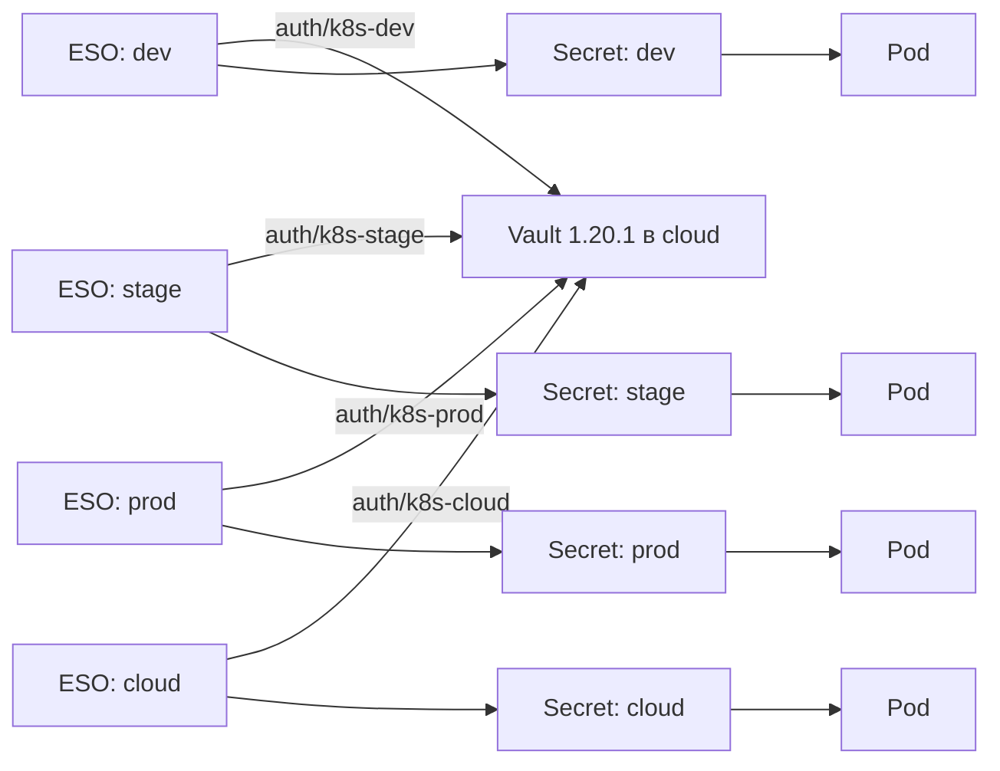

# Vault и External Secrets Operator в Kubernetes

Практическая схема для четырех независимых Kubernetes-кластеров:
`dev`, `stage`, `prod`, `cloud`. HashiCorp Vault работает в `cloud`,
приложения развертываются через Helm и Argo CD, а External Secrets Operator
(ESO) переносит значения из Vault KV v2 в обычные Kubernetes Secret.

## Проверенное состояние

Состояние проверено 20 июля 2026 года без чтения значений Secret.

| Окружение | Kubernetes | Vault | ESO |
| --- | --- | --- | --- |
| `dev` | `v1.28.3` | внешний `https://vault.oro.moscow` | `v2.1.0`, CRD storage version `v1` |
| `stage` | `v1.28.3` | внешний `https://vault.oro.moscow` | не установлен |
| `prod` | `v1.28.3` | внешний `https://vault.oro.moscow` | не установлен |
| `cloud` | `v1.32.3` | `v1.20.1`, HA, initialized, unsealed | не установлен |

В `dev` уже работает следующая цепочка:

- `ClusterSecretStore/vault-backend` имеет статус `Valid`;
- `ExternalSecret/points-adm-secret` в `mediascope` имеет статус
  `SecretSynced`;
- источник: `secret/dev/mediascope/app/backend/points-adm`;
- целевой Secret: `points-adm-secret`;
- Deployment `points-adm` подключает его через `envFrom`;
- Deployment полностью развернут, приложение Argo CD имеет состояния
  `Synced` и `Healthy`.

Локальный `kubectl v1.36.2` новее серверов больше чем на поддерживаемый один
minor release. Для административных операций нужно использовать версии
`kubectl`, совместимые с соответствующим сервером.

## Архитектура



Один Kubernetes auth mount нельзя считать границей между независимыми
кластерами. Для каждого кластера используются отдельные:

- auth mount;
- Vault policy;
- Vault role;
- Kubernetes API endpoint и CA;
- ServiceAccount ESO;
- путь окружения в KV v2.

Рекомендуемая структура продолжает уже используемый путь в `dev`:

```text
secret/
  dev/<namespace>/app/<type>/<service>
  stage/<namespace>/app/<type>/<service>
  prod/<namespace>/app/<type>/<service>
  cloud/<namespace>/app/<type>/<service>
```

Например:

```text
secret/dev/mediascope/app/backend/points-adm
```

В командах Vault KV путь записывается как `secret/dev/...`, а в policy для
KV v2 используется API-путь `secret/data/dev/...`.

## Что хранить в Vault

Для `points-adm` в Vault перенесены или должны быть перенесены:

- `POSTGRES_USER`;
- `POSTGRES_PASSWORD`;
- `KAFKA_USERNAME`;
- `KAFKA_PASSWORD`;
- `KEYCLOAK_CLIENT_SECRET`;
- `SHOWCASE_USER`;
- `SHOWCASE_PASSWORD`.

В Helm values остаются несекретные настройки: адреса и порты, имена баз,
Kafka topics и group ID, realm и client ID, URL внутренних сервисов,
уровень логирования, feature flags и параметры OpenTelemetry.

Имя пользователя иногда не считается секретом, но хранение пары
`USER`/`PASSWORD` в одном объекте упрощает ротацию и исключает расхождение
конфигурации.

## Немедленные действия при раскрытии

Исходная заметка содержала значения, похожие на действующие пароли и client
secret. Файл `Vault/pre_vault.md` исключен через `.gitignore` и на момент
проверки не присутствовал ни в индексе, ни в истории Git. Это не отменяет
компрометацию значений.

Для каждого раскрытого значения:

1. Определить владельца системы и зависимые приложения.
2. Создать новое значение в PostgreSQL, Kafka, Keycloak или другой системе.
3. Записать новое значение в Vault.
4. Дождаться `SecretSynced`.
5. Перезапустить потребляющий Deployment.
6. Проверить startup, readiness и операции приложения.
7. Отозвать старое значение.
8. Зафиксировать ротацию в защищенном операционном журнале.

Не отмечайте ротацию выполненной только по факту изменения Vault: старое
значение должно быть отозвано в исходной системе.

Для проверки репозитория используйте secret scanner, например Gitleaks:

```bash
gitleaks git .
```

Если scanner находит реальный секрет в истории, сначала ротируйте значение.
Очистку истории согласуйте со всеми пользователями репозитория: переписывание
истории само по себе не делает опубликованный секрет снова безопасным.

## Безопасная запись в KV v2

Не передавайте реальные значения аргументами CLI: они попадут в shell history
и могут быть видны в списке процессов. Предпочтителен CI job или password
manager с краткоживущей Vault-аутентификацией.

Для ручной аварийной операции можно прочитать значения без echo и передать
JSON через stdin:

```bash
read -rsp 'POSTGRES_USER: ' POSTGRES_USER
printf '\n'
read -rsp 'POSTGRES_PASSWORD: ' POSTGRES_PASSWORD
printf '\n'

jq -n \
  --arg user "$POSTGRES_USER" \
  --arg password "$POSTGRES_PASSWORD" \
  '{POSTGRES_USER: $user, POSTGRES_PASSWORD: $password}' |
  vault kv patch -mount=secret \
    dev/mediascope/app/backend/points-adm -

unset POSTGRES_USER POSTGRES_PASSWORD
```

Перед применением проверьте поддержку stdin командой
`vault kv patch -help`. Не включайте `set -x`, не сохраняйте JSON на диск и
не вставляйте значения в issue, wiki или Argo CD parameters.

## Сеть и TLS

Из каждого кластера должны быть доступны:

- DNS-имя `vault.oro.moscow`;
- TCP `443` до ingress Vault или TCP `8200` при прямом подключении;
- корректный обратный маршрут;
- Kubernetes API каждого кластера из Vault для TokenReview;
- доверенная цепочка сертификата Vault.

Проверка с временного диагностического Pod:

```bash
kubectl --context kubernetes-admin@dev run vault-netcheck \
  --namespace external-secrets \
  --image=curlimages/curl:8.10.1 \
  --restart=Never \
  --rm -it -- \
  curl --fail --silent --show-error \
    https://vault.oro.moscow/v1/sys/health
```

Повторите для `stage`, `prod`, `cloud`. Команда создает временный Pod, поэтому
в production ее выполняют только в согласованное окно. Не используйте
`curl -k`. Для внутреннего CA создайте ConfigMap с CA bundle и укажите
`caProvider` в `ClusterSecretStore`.

Успешный ответ health endpoint подтверждает сеть и TLS, но не проверяет
Kubernetes auth или Vault policy.

## Kubernetes auth без постоянного reviewer token

Ниже используется короткоживущий токен ServiceAccount ESO. Vault применяет
JWT клиента при обращении к TokenReview API; постоянный
`token_reviewer_jwt` в Vault не хранится.

### ServiceAccount и TokenReview

В каждом кластере:

```bash
kubectl --context kubernetes-admin@dev \
  create namespace external-secrets

kubectl --context kubernetes-admin@dev \
  create serviceaccount external-secrets \
  --namespace external-secrets

kubectl --context kubernetes-admin@dev \
  create clusterrolebinding external-secrets-tokenreview \
  --clusterrole=system:auth-delegator \
  --serviceaccount=external-secrets:external-secrets
```

Если namespace, ServiceAccount или binding уже существуют, управляйте ими
через GitOps вместо повторного `kubectl create`.

### Конфигурация auth mount

Для каждого окружения подготовьте доступный Vault URL Kubernetes API и CA:

```bash
vault auth enable -path=k8s-dev kubernetes

vault write auth/k8s-dev/config \
  kubernetes_host="https://KUBERNETES_API_DEV" \
  kubernetes_ca_cert=@dev-ca.crt \
  disable_local_ca_jwt=true
```

Повторите с mount `k8s-stage`, `k8s-prod`, `k8s-cloud`. Параметр
`disable_local_ca_jwt=true` важен для удаленных кластеров: Vault работает
в `cloud` и не должен случайно использовать локальные CA/JWT для проверки
токена из `dev`, `stage` или `prod`.

Проверьте конфигурацию без вывода credentials:

```bash
vault read auth/k8s-dev/config
```

### Policy

Файл `dev-policy.hcl`:

```hcl
path "secret/data/dev/*" {
  capabilities = ["read"]
}
```

Применение:

```bash
vault policy write dev-policy dev-policy.hcl
```

Для остальных окружений замените оба вхождения `dev`. Не выдавайте policy
одного окружения роли другого окружения.

### Role

Vault `1.20.1` предупреждает о Kubernetes role без audience; в Vault `1.21+`
audience станет обязательной. Настройте ее заранее:

```bash
vault write auth/k8s-dev/role/app \
  bound_service_account_names=external-secrets \
  bound_service_account_namespaces=external-secrets \
  bound_audiences=vault \
  policies=dev-policy \
  token_type=batch \
  ttl=1h
```

Проверка:

```bash
vault read auth/k8s-dev/role/app
```

ESO должен запрашивать ServiceAccount token с той же audience `vault`.

## Установка ESO

В `dev` уже установлен ESO `v2.1.0`. Сначала установите ту же версию в
`stage`, затем в `prod` и `cloud`, чтобы не смешивать rollout с обновлением
версии:

```bash
helm repo add external-secrets \
  https://charts.external-secrets.io
helm repo update

helm upgrade --install external-secrets \
  external-secrets/external-secrets \
  --namespace external-secrets \
  --create-namespace \
  --version 2.1.0 \
  --set serviceAccount.name=external-secrets
```

В рабочей инфраструктуре release и RBAC должны быть описаны декларативно в
Argo CD. Команды выше предназначены для проверки и первичного bootstrap.

Проверка версии и CRD:

```bash
kubectl get deployment external-secrets \
  --namespace external-secrets \
  -o jsonpath='{.spec.template.spec.containers[0].image}{"\n"}'

kubectl get crd \
  secretstores.external-secrets.io \
  clustersecretstores.external-secrets.io \
  externalsecrets.external-secrets.io \
  -o custom-columns=NAME:.metadata.name,STORAGE:.status.storedVersions
```

Для ESO `v2.1.0` в `dev` используется `external-secrets.io/v1`. Не копируйте
старые примеры `v1beta1`.

## ClusterSecretStore

Текущий `dev` использует `ClusterSecretStore`, поэтому этот вариант выбран
для всех окружений. Он уменьшает дублирование, но расширяет blast radius:
доступ к store нужно ограничить через `spec.conditions` или admission policy,
если разные команды не должны использовать общий store.

Обезличенный рабочий пример находится в
[`examples/templates/secret-store.yaml`](examples/templates/secret-store.yaml).
Для cluster-scoped store у `serviceAccountRef` обязательно задается
`namespace`.

Основные поля для `dev`:

```yaml
apiVersion: external-secrets.io/v1
kind: ClusterSecretStore
metadata:
  name: vault-backend
spec:
  provider:
    vault:
      server: https://vault.oro.moscow
      path: secret
      version: v2
      auth:
        kubernetes:
          mountPath: k8s-dev
          role: app
          serviceAccountRef:
            name: external-secrets
            namespace: external-secrets
            audiences:
              - vault
```

Если используется внутренний CA:

```yaml
      caProvider:
        type: ConfigMap
        name: vault-ca
        namespace: external-secrets
        key: ca.crt
```

Проверка:

```bash
kubectl get clustersecretstore vault-backend
kubectl describe clustersecretstore vault-backend
```

Ожидаются `READY=True`, `STATUS=Valid`.

## ExternalSecret для points-adm

Текущий источник и целевой Secret:

```yaml
apiVersion: external-secrets.io/v1
kind: ExternalSecret
metadata:
  name: points-adm-secret
  namespace: mediascope
spec:
  refreshPolicy: Periodic
  refreshInterval: 1h
  secretStoreRef:
    name: vault-backend
    kind: ClusterSecretStore
  target:
    name: points-adm-secret
    creationPolicy: Owner
    deletionPolicy: Retain
  dataFrom:
    - extract:
        key: dev/mediascope/app/backend/points-adm
```

Полный пример:
[`examples/templates/external-secret.yaml`](examples/templates/external-secret.yaml).

- `Periodic` повторно читает Vault через `refreshInterval`.
- `Owner` создает Secret и добавляет owner reference на ExternalSecret.
- `Retain` сохраняет текущий Secret и переводит ExternalSecret в ошибку, если
  источник исчез.
- Временная недоступность Vault не удаляет существующий Secret, но новые Pod
  нельзя считать успешно обновленными, пока condition не вернулся в
  `SecretSynced`.

## Helm: env и envFrom

`env` и `envFrom` являются соседними полями контейнера:

```yaml
containers:
  - name: {{ .Values.name }}
    image: {{ .Values.image | quote }}
    envFrom:
      {{- toYaml .Values.envFrom | nindent 6 }}
    env:
      {{- range $name, $value := .Values.env }}
      - name: {{ $name }}
        value: {{ $value | quote }}
      {{- end }}
```

Values:

```yaml
envFrom:
  - secretRef:
      name: points-adm-secret

env:
  SERVICE_ENV: DEV
  SERVICE_NAME: points-adm
  POSTGRES_SERVER: db.dev.example.internal
  POSTGRES_PORT: "5432"
  POSTGRES_DB: points_pds
```

Полный chart находится в [`examples`](examples). Проверка:

```bash
helm lint Vault/examples
helm template points-adm Vault/examples \
  --namespace mediascope > /tmp/points-adm-rendered.yaml
```

Проверьте итоговый контейнер:

```bash
helm template points-adm Vault/examples \
  --namespace mediascope |
  yq '. | select(.kind == "Deployment")
      | .spec.template.spec.containers[]
      | {name, envFrom, env}'
```

### Точечный secretKeyRef

Когда имена ключей Vault не должны становиться именами environment variables:

```yaml
env:
  - name: DATABASE_PASSWORD
    valueFrom:
      secretKeyRef:
        name: points-adm-secret
        key: POSTGRES_PASSWORD
```

Не задавайте одну переменную одновременно через `envFrom` и `env`: значение
из `env` имеет приоритет и может незаметно перекрыть Secret.

## Argo CD

Рекомендуемые sync waves:

| Wave | Ресурс |
| --- | --- |
| `-30` | namespace, ESO release и CRD |
| `-20` | ServiceAccount и TokenReview RBAC |
| `-10` | ClusterSecretStore и ExternalSecret |
| `0` | Deployment приложения |

Аннотация:

```yaml
metadata:
  annotations:
    argocd.argoproj.io/sync-wave: "-10"
```

Sync wave гарантирует порядок применения Git-ресурсов, но не гарантирует, что
ESO успеет создать Secret до запуска Pod. Для первого rollout:

1. Синхронизируйте ESO, RBAC, store и ExternalSecret.
2. Дождитесь `SecretSynced`.
3. Проверьте наличие ожидаемых ключей.
4. Синхронизируйте Deployment с `envFrom`.

Для единой sync operation добавьте в Argo CD health check для
`ExternalSecret`, который считает ресурс Healthy только при condition
`Ready=True`.

## Ротация и перезапуск Pod

ESO обновляет Kubernetes Secret, но переменные окружения уже запущенного
контейнера не меняются. Выбранный базовый механизм: контролируемый rollout
после подтвержденной синхронизации.

```bash
kubectl --context kubernetes-admin@dev \
  --namespace mediascope \
  annotate externalsecret points-adm-secret \
  force-sync="$(date +%s)" --overwrite

kubectl --context kubernetes-admin@dev \
  --namespace mediascope \
  wait externalsecret/points-adm-secret \
  --for=condition=Ready \
  --timeout=2m

kubectl --context kubernetes-admin@dev \
  --namespace mediascope \
  rollout restart deployment/points-adm

kubectl --context kubernetes-admin@dev \
  --namespace mediascope \
  rollout status deployment/points-adm \
  --timeout=5m
```

В GitOps-процессе эти действия выполняет защищенный rotation pipeline.
Автоматический контроллер рестартов можно добавить отдельно, но он должен
быть явно одобрен: массовая ротация способна одновременно перезапустить много
сервисов.

## Безопасная проверка

### ESO и SecretStore

```bash
kubectl get clustersecretstore vault-backend
kubectl get externalsecret points-adm-secret -n mediascope
kubectl describe externalsecret points-adm-secret -n mediascope
```

### Только имена ключей Secret

Команда не декодирует и не печатает значения:

```bash
kubectl get secret points-adm-secret \
  --namespace mediascope \
  -o go-template='{{range $key, $value := .data}}{{$key}}{{"\n"}}{{end}}'
```

Не используйте `kubectl get secret -o yaml`, `base64 -d` или `env` в
демонстрационных и CI-логах.

### Ссылка Deployment на Secret

```bash
kubectl get deployment points-adm \
  --namespace mediascope \
  -o jsonpath='{range .spec.template.spec.containers[*]}
{.name}{" envFrom="}{range .envFrom[*]}{.secretRef.name}{","}{end}{"\n"}
{end}'
```

### Наличие переменных без значений

Если образ содержит POSIX shell:

```bash
kubectl exec deployment/points-adm -n mediascope -- sh -c '
  failed=0
  for name in POSTGRES_USER POSTGRES_PASSWORD KAFKA_USERNAME \
    KAFKA_PASSWORD KEYCLOAK_CLIENT_SECRET SHOWCASE_USER SHOWCASE_PASSWORD
  do
    if printenv "$name" >/dev/null; then
      printf "%s: present\n" "$name"
    else
      printf "%s: missing\n" "$name"
      failed=1
    fi
  done
  exit "$failed"
'
```

После этого проверьте rollout, readiness и прикладной health endpoint.

## Диагностика

### Argo CD: does not contain declared merge key: name

Причина в исходном случае: обычные переменные были ошибочно вложены в элемент
списка `envFrom`:

```yaml
env:
envFrom:
  - secretRef:
      name: points-adm-secret
    SERVICE_ENV: DEV
```

`envFrom` принимает только объекты `secretRef` и `configMapRef`. Исправление:

```yaml
envFrom:
  - secretRef:
      name: points-adm-secret

env:
  SERVICE_ENV: DEV
```

Всегда проверяйте chart через `helm lint` и `helm template` до commit.

### Secret создан, приложение не видит переменные

1. Проверить `.status.conditions` ExternalSecret.
2. Проверить только имена ключей целевого Secret.
3. Проверить `envFrom` в live Deployment, не только в values.
4. Проверить, что имя Secret совпадает. Текущее имя:
   `points-adm-secret`; старое `points-adm-env` больше не используется.
5. Проверить новый ReplicaSet и завершение rollout.
6. Проверить наличие переменных внутри нового Pod без печати значений.
7. Проверить, не перекрывает ли `env` значения из `envFrom`.

### ClusterSecretStore не готов

Проверить:

- DNS и TLS до `vault.oro.moscow`;
- CA bundle;
- `mountPath` нужного окружения;
- Vault role и совпадение audience;
- namespace у `serviceAccountRef`;
- binding `system:auth-delegator`;
- доступ Vault до Kubernetes API;
- policy на `secret/data/<environment>/*`.

### Vault временно недоступен

Существующий Secret при `deletionPolicy: Retain` остается. Не запускайте
ротацию и не считайте новый rollout успешным, пока ExternalSecret не вернулся
в `Ready=True/SecretSynced`. Проверьте логи ESO, но не повышайте их уровень
так, чтобы provider payload попадал в лог.

## Rollout

1. Завершить ротацию раскрытых credential для `points-adm`.
2. Зафиксировать успешный пилот `points-adm` в `dev`.
3. Перенести остальные `dev`-сервисы небольшими группами.
4. Установить ESO и настроить `k8s-stage`, выполнить один пилот в `stage`.
5. Повторить для `prod` в согласованное окно.
6. Настроить `cloud` только для workload, которым действительно нужны
   секреты из Vault.
7. После каждого этапа проверить отсутствие секретов в values и Git history.

Для каждого сервиса сохраняйте матрицу:

```text
service | Vault path | ExternalSecret | target Secret | Deployment | owner
```

## Откат

Не возвращайте секреты в values.

1. Остановить rollout новых Pod.
2. Откатить Deployment на предыдущую версию chart, которая также читает
   Kubernetes Secret.
3. При необходимости восстановить предыдущую версию значения KV v2 в Vault.
4. Дождаться `SecretSynced`.
5. Выполнить контролируемый rollout Deployment.
6. Проверить приложение.

Если предыдущий chart не поддерживает `envFrom`, заранее подготовьте
совместимую rollback-версию с `secretKeyRef`. Откат к plaintext в Git
недопустим.

## Источники

- [ESO: HashiCorp Vault provider](https://external-secrets.io/latest/provider/hashicorp-vault/)
- [ESO: ExternalSecret API](https://external-secrets.io/latest/api/externalsecret/)
- [HashiCorp Vault: Kubernetes auth](https://developer.hashicorp.com/vault/docs/auth/kubernetes)
- [Kubernetes: использование Secret в Pod](https://kubernetes.io/docs/tasks/inject-data-application/distribute-credentials-secure/)
- [Argo CD: sync phases and waves](https://argo-cd.readthedocs.io/en/stable/user-guide/sync-waves/)
